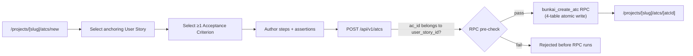
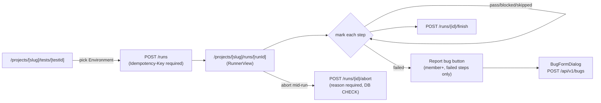
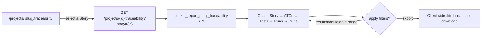
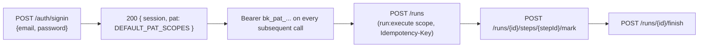
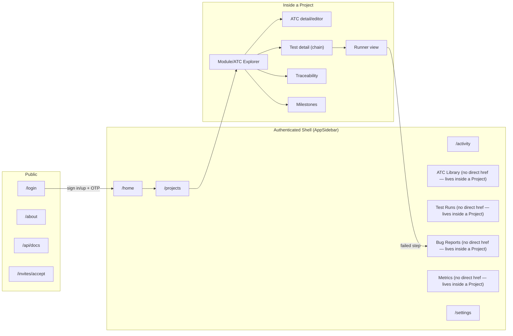

# User Journeys — Bunkai (Discovery View)

> Generated by: `/project-discovery` Phase 2, sub-step 3 (User Journeys)
> Generated: 2026-08-15
> **Mindset**: routes are journey steps, redirects are transitions, form submit handlers reveal the next step. Every step below cites a file; a step without a citation is a guess and is flagged as a Discovery Gap instead.

---

## 1. Route Map

### Public Routes (Unauthenticated)

| Route | Page | Purpose |
|---|---|---|
| `/login` | `app/(auth)/login/page.tsx` | Sign-in / sign-up / OTP-confirm entry point (email-first 3-step state machine) |
| `/about` | `app/about/page.tsx` | Marketing walkthrough ("Cómo funciona Bunkai") |
| `/invites/accept` | `app/invites/accept/page.tsx` | Invite-redemption landing; internally redirects to `/login?next=...` if the visitor is not signed in (`accept-client.tsx:64`) |
| `/api/docs` | `app/api/docs/page.tsx` | Interactive OpenAPI documentation (Scalar UI) |
| `/design-tokens` | `app/design-tokens/page.tsx` | Design-system color/token reference |
| `/qa` | `app/qa/page.tsx` | Internal software-testability guide (FEAT-041) — not gated, but not a product journey |
| `/auth/callback` | `app/auth/callback/route.ts` | Magic-link + OAuth code-exchange callback (not a page — a route handler) |

Source: `middleware.ts` `PUBLIC_PREFIXES = ['/login', '/auth', '/api/auth']`; the remaining rows above are simply absent from `PROTECTED_PREFIXES` and confirmed unauthenticated by direct inspection of each page's own server component.

### Protected Routes (Authenticated)

| Route | Page | Requires (role) | Purpose |
|---|---|---|---|
| `/home` | `app/(app)/home/page.tsx` | Any signed-in member | Landing dashboard — active runs, coverage, open bugs, recent activity/projects |
| `/onboarding` | `app/(app)/onboarding/page.tsx` | Any signed-in member with **no** workspace | First-run workspace-creation form; short-circuits to `/projects` if a membership already exists |
| `/projects` | `app/(app)/projects/page.tsx` | Any signed-in member | Project list for the active workspace |
| `/projects/new` | `app/(app)/projects/new/page.tsx` | Any signed-in member | New project form |
| `/projects/[projectSlug]` | `app/(app)/projects/[projectSlug]/page.tsx` | Any signed-in member (read); `role !== 'viewer'` for create affordances | Project explorer (module tree, ATCs, Tests) |
| `/projects/[projectSlug]/atcs/new` | `.../atcs/new/page.tsx` | `role !== 'viewer'` | New ATC form |
| `/projects/[projectSlug]/atcs/[atcId]` | `.../atcs/[atcId]/page.tsx` | Any signed-in member (read); `role !== 'viewer'` to edit | ATC detail/editor |
| `/projects/[projectSlug]/tests/new` | `.../tests/new/page.tsx` | `role !== 'viewer'` | New Test builder |
| `/projects/[projectSlug]/tests/[testId]` | `.../tests/[testId]/page.tsx` | Any signed-in member (read); member+ to reorder/start run | Test detail (ATC chain) |
| `/projects/[projectSlug]/tests/[testId]/runs` | `.../tests/[testId]/runs/page.tsx` | Any signed-in member | Per-Test run history |
| `/projects/[projectSlug]/runs` | `.../runs/page.tsx` | Any signed-in member | Project-wide Run report |
| `/projects/[projectSlug]/runs/[runId]` | `.../runs/[runId]/page.tsx` | Any signed-in member (read); member+ to mark/abort/finish | Runner view — active Run execution surface |
| `/projects/[projectSlug]/bugs` | `.../bugs/page.tsx` | Any signed-in member (read); `role !== 'viewer'` to file | Bug list/filter |
| `/projects/[projectSlug]/bugs/[bugId]` | `.../bugs/[bugId]/page.tsx` | Any signed-in member (read) | Bug detail |
| `/projects/[projectSlug]/milestones` | `.../milestones/page.tsx` | Any signed-in member (read); `role !== 'viewer'` to create | Milestone list |
| `/projects/[projectSlug]/milestones/[milestoneId]` | `.../milestones/[milestoneId]/page.tsx` | Any signed-in member (read); `['member','admin','owner']` to edit | Milestone detail |
| `/projects/[projectSlug]/metrics` | `.../metrics/page.tsx` | Any signed-in member | Bug heatmap + recovery-cycle metrics |
| `/projects/[projectSlug]/traceability` | `.../traceability/page.tsx` | Any signed-in member | Traceability Chain Report + filters + export |
| `/workspaces/[id]/members` | `app/(app)/workspaces/[id]/members/page.tsx` | Any signed-in member (read); `workspace:admin` to manage | Workspace member list, leave-workspace |
| `/settings` | `app/(app)/settings/page.tsx` | Any signed-in member | Settings hub |
| `/settings/account` | `.../settings/account/page.tsx` | Any signed-in member | Identity card, sign-out |
| `/settings/notifications` | `.../settings/notifications/page.tsx` | Any signed-in member | Notification preference grid |
| `/settings/tokens` | `.../settings/tokens/page.tsx` | Any signed-in member (issuance role-gated server-side) | PAT list/issue/revoke |
| `/settings/workspaces` | `.../settings/workspaces/page.tsx` | Any signed-in member | Workspace list, leave-workspace |
| `/activity` | `app/(app)/activity/page.tsx` | Any signed-in member | Workspace activity feed |

Source: `middleware.ts` `PROTECTED_PREFIXES = ['/home', '/projects', '/onboarding', '/settings', '/activity']` (gate); per-page `role !== 'viewer'`/scope checks confirmed individually in `business-feature-map.md` and direct file reads above.

### Dynamic Routes

| Pattern | Example | Purpose |
|---|---|---|
| `/projects/[projectSlug]` | `/projects/bunkai-web` | Project detail — slug is unique **per workspace**, not globally (BK-52) |
| `/projects/[projectSlug]/atcs/[atcId]` | `/projects/bunkai-web/atcs/d3e4f5a6-...` | ATC detail/editor |
| `/projects/[projectSlug]/tests/[testId]` | `/projects/bunkai-web/tests/e4f5a6b7-...` | Test detail |
| `/projects/[projectSlug]/tests/[testId]/runs` | `/projects/bunkai-web/tests/e4f5a6b7-.../runs` | Per-Test run history |
| `/projects/[projectSlug]/runs/[runId]` | `/projects/bunkai-web/runs/a6b7c8d9-...` | Runner view for a specific Run |
| `/projects/[projectSlug]/bugs/[bugId]` | `/projects/bunkai-web/bugs/b7c8d9e0-...` | Bug detail |
| `/projects/[projectSlug]/milestones/[milestoneId]` | `/projects/bunkai-web/milestones/c8d9e0f1-...` | Milestone detail |
| `/workspaces/[id]/members` | `/workspaces/6f2e1c9a-.../members` | Workspace member list (id, not slug) |

---

## 2. Journey 1 — New User Onboarding (browser)

**Persona**: any first-time human user (becomes Workspace Owner/Admin on completion) · **Goal**: create an account and stand up their first workspace · **Discovered From**: `middleware.ts`, `app/(auth)/login/*`, `app/(app)/onboarding/*`

### Flow Diagram

```mermaid
flowchart LR
    A[/login] -->|"email-first form"| B{check-email}
    B -->|new email| C[signup + password]
    C --> D[6-digit OTP confirm]
    D -->|mandatory, no bypass| E[session + PAT minted]
    B -->|existing email| F[password sign-in]
    F --> E
    E --> G{"has workspace?"}
    G -->|no| H[/onboarding]
    H -->|bootstrap workspace RPC| I[/projects]
    G -->|yes| I
```

### Step-by-Step Flow

| Step | Page | Action | Next | Evidence (file:line) |
|---|---|---|---|---|
| 1 | `/login` | Enter email | Router checks whether the email exists | `app/(auth)/login/email-first-form.tsx:49-91` (`check-email`) |
| 2a | `/login` | New email → enter password, submit sign-up | Mandatory OTP step | `email-first-form.tsx:140-166` (`POST /auth/signup`) |
| 2b | `/login` | Existing email → enter password, submit sign-in | Session + PAT minted inline | `email-first-form.tsx:101-130` (`POST /auth/signin`) |
| 3 | `/login` | Enter 6-digit OTP code | Session + PAT minted, no bypass | `email-first-form.tsx:176-199` (`POST /auth/confirm`) |
| 4 | (server redirect) | `middleware.ts` sees `/onboarding` is protected, user has a session | Renders onboarding form if no workspace membership exists | `app/(app)/onboarding/page.tsx:8-23` |
| 5 | `/onboarding` | Fill workspace slug + name, submit | `POST /api/v1/workspaces` → `bunkai_bootstrap_workspace` RPC | `app/(app)/onboarding/onboarding-form.tsx:89` |
| 6 | (redirect) | Workspace created | Lands on `/projects` | `onboarding-form.tsx` (post-fetch redirect); confirmed pattern in `onboarding/page.tsx:22-23` for the already-has-workspace case |

### Error Paths

| Error | Handling | Evidence |
|---|---|---|
| Email/password wrong on sign-in | `setError('That email or password is incorrect.')` — generic, does not disclose account existence | `email-first-form.tsx:123` |
| Sign-in attempted before OTP confirmed | `setError('Verify your email with the code we sent before signing in.')` | `email-first-form.tsx:119` |
| Sign-up on an email that already has an account | `setError('An account already exists for this email. Try signing in instead.')` | `email-first-form.tsx:159` |
| Wrong/expired OTP code | `setError('That code is invalid or expired.')` | `email-first-form.tsx:192` |
| Rate-limited on any auth step | `setError('Too many attempts. Please wait a moment and retry.')` | `email-first-form.tsx:73,113,155,188,228` |
| Magic-link clicked cross-device | **Not supported** — BK-400 explicitly reverted cross-device magic-link as "the dangerous part"; still same-device/PKCE only | `business-api-map.md` §"Token flow — Magic-link" |

### Success Criteria

- [ ] New email reaches a usable session only after OTP confirmation (no bypass path exists)
- [ ] A signed-in user with zero workspace memberships is routed to `/onboarding`, never shown an empty `/projects`
- [ ] `bunkai_bootstrap_workspace` creates both the `workspaces` row and the creator's `owner` `workspace_members` row atomically
- [ ] A returning user (already has a workspace) is routed straight to `/projects`, `/onboarding` short-circuits for them

---

## 3. Journey 2 — ATC Authoring Anchored to a User Story (member+)

**Persona**: QA/Dev Contributor (member) · **Goal**: author a reusable Acceptance Test Case that satisfies the product's core anchoring invariant · **Discovered From**: `components/atcs/NewAtcEditor.tsx`, `app/api/v1/atcs/route.ts`, `domain-glossary.md` BR-01

### Flow Diagram



### Step-by-Step Flow

| Step | Page | Action | Next | Evidence (file:line) |
|---|---|---|---|---|
| 1 | `/projects/[slug]/atcs/new` | Open the new-ATC form (member+ only; viewer never sees this route's entry affordance) | Editor renders | `NewAtcEditor.tsx`; `layout.tsx:69` `canCreate` gate |
| 2 | same | Pick anchoring `user_story_id` and ≥1 `acceptance_criterion_id` via `AnchoringPanel.tsx` | Enables save | `components/atcs/AnchoringPanel.tsx` (referenced in `business-feature-map.md` FEAT-018) |
| 3 | same | Author ordered steps (`StepEditor.tsx`) and assertions (YAML) | Payload assembled | `NewAtcEditor.tsx:197-206` (`steps`, `assertionsYaml` parsed) |
| 4 | same | Submit | `fetch('/api/v1/atcs', { method: 'POST', ... })` | `NewAtcEditor.tsx:206` |
| 5 | (server) | `bunkai_create_atc` RPC validates every `ac_id` belongs to the given `user_story_id` and `module_id` is the Story's own module or a descendant, **before** the atomic 4-table write | `domain-glossary.md` BR-01; `business-data-map.md` Flow 5 |
| 6 | (redirect) | On success, lands on the new ATC's detail page | `/projects/[slug]/atcs/[atcId]` | Inferred from standard create→detail redirect pattern; not independently re-read this pass (Discovery Gap) |

### Error Paths

| Error | Handling | Evidence |
|---|---|---|
| `ac_id` referenced does not belong to the given `user_story_id` | Request rejected **before** the RPC transaction runs — no partial write, no orphan `atc_steps` | `domain-glossary.md` BR-01 Given/When/Then |
| Exact rejection error message/shape | **Not directly observed this pass** — Discovery Gap, read `app/api/v1/atcs/route.ts` directly before asserting a specific error string in a test | `domain-glossary.md` §8 |
| A `viewer`-role user attempts the create route directly (bypassing the hidden UI entry point) | Expected to be rejected server-side (RLS + role check), not independently re-verified this pass | Discovery Gap |

### Success Criteria

- [ ] ATC creation is impossible without a User Story + ≥1 Acceptance Criterion (BR-01)
- [ ] The create endpoint is identical for browser and machine callers (unified REST path, `business-api-map.md` Journey 4)
- [ ] A failed anchoring check leaves no orphan `atc_steps`/`atc_assertions` rows

---

## 4. Journey 3 — Manual Run Execution + Bug Filing (member+)

**Persona**: QA/Dev Contributor (member) · **Goal**: execute a Test's ATC chain against an Environment, record per-step results, and file a Bug on a failure without losing context · **Discovered From**: `components/tests/StartRunButton.tsx`, `components/runs/RunnerView.tsx`, `components/bugs/BugFormDialog.tsx`

### Flow Diagram



### Step-by-Step Flow

| Step | Page | Action | Next | Evidence (file:line) |
|---|---|---|---|---|
| 1 | `/projects/[slug]/tests/[testId]` | Click "Start run", pick an Environment | Idempotency key generated client-side, one per attempt | `components/tests/StartRunButton.tsx:30-38` |
| 2 | same | Submit | `POST /api/v1/runs` with `Idempotency-Key` header; snapshots every step as `pending` | `StartRunButton.tsx` header comment; `runs/route.ts:46-140` |
| 3 | (redirect) | Run created | `/projects/[slug]/runs/[runId]` (RunnerView) | Inferred from `router` usage in `StartRunButton.tsx` (`useRouter` imported) |
| 4 | RunnerView | Mark a step Pass/Fail/Blocked/Skipped, optional note/evidence URL | `POST /runs/{id}/steps/{stepId}/mark` | `components/runs/RunnerView.tsx:857-860` (pressed-state buttons) |
| 5 | RunnerView | On a **failed** step, click "Report bug" (member+ only — viewers get no affordance at all) | Opens `BugFormDialog` pre-filled with run/step/module context | `RunnerView.tsx:116,898-912` |
| 6 | BugFormDialog | Submit bug (title, severity, description, steps-to-reproduce, evidence URLs) | `POST /api/v1/bugs` — `bugs_check_consistency` trigger validates run_step/atc/run/project belong together before insert | `components/bugs/BugFormDialog.tsx`; `domain-glossary.md` BR-03 |
| 7 | RunnerView | All steps marked (or explicitly finished early) | `POST /runs/{id}/finish` — remaining `pending` steps auto-`skipped`; fires `activity_log_notify_run_event` trigger → Notification | `RunnerView.tsx:655-659` (final-verdict modal shown only on `passed`/`failed`) |

### Error Paths

| Error | Handling | Evidence |
|---|---|---|
| `POST /runs` sent without `Idempotency-Key` header | Hard failure — header is REQUIRED, not optional (behavior change from an earlier "planned" framing) | `business-api-map.md` §7 GAP-15 |
| Duplicate `POST /runs` with the same `Idempotency-Key` within 24h | Returns the original Run's data, not a new Run row (replay-safe) | `domain-glossary.md` BR-06 |
| Abort attempted with an empty/whitespace `abort_reason` | Rejected at the **DB layer** (`runs_abort_reason_chk` CHECK constraint), even if a crafted request bypasses API-layer validation | `domain-glossary.md` BR-02 |
| Bug-filing payload with a `run_step_id` from one Run but an `atc_id` from an unrelated Run | `bugs_check_consistency` trigger rejects the insert | `domain-glossary.md` BR-03 |
| No environments configured for the Test | UI renders `"No environments configured"` instead of the Start-run control (never a dead/broken button) | `StartRunButton.tsx:43-48` |

### Success Criteria

- [ ] A double-submit of Start-run (same idempotency key) never creates two Runs
- [ ] Aborting without a reason is rejected at the DB layer, not just the client form
- [ ] Filing a bug from a failed step correctly carries `run_id`/`run_step_id`/`atc_id`/`project_id` and the trigger accepts it
- [ ] Finishing a Run with steps still `pending` auto-transitions them to `skipped`, never leaves them dangling

---

## 5. Journey 4 — Traceability Chain Review (any role, read-only)

**Persona**: Read-Only Stakeholder (viewer) or any other role — this is the one core journey every role can complete identically · **Goal**: answer "is this User Story actually covered, and did the covering tests pass?" in one read · **Discovered From**: `components/traceability/TraceabilityChainView.tsx`, `app/api/v1/projects/[id]/traceability/route.ts` (via `business-api-map.md` Journey 7)

### Flow Diagram



### Step-by-Step Flow

| Step | Page | Action | Next | Evidence (file:line) |
|---|---|---|---|---|
| 1 | `/projects/[slug]/traceability` | Select a Story to inspect | `GET /projects/{id}/traceability?story={id}` | `business-api-map.md` Journey 7 |
| 2 | (server) | `bunkai_report_story_traceability` RPC assembles the chain live — no dedicated table, pure read | Chain rendered | `supabase/migrations/0068_story_traceability_report.sql`; `business-feature-map.md` FEAT-050 |
| 3 | Traceability page | Apply filters — result (multi-toggle), module, date range | Chain re-renders filtered | `TraceabilityChainView.tsx:124-261` (`FilterBar`) |
| 4 | Traceability page | Click Export | Downloads a self-contained `.html` snapshot, 100% client-side, no server storage | `lib/traceability/export-snapshot.ts:19-33`; `TraceabilityChainView.tsx:92,430,612-618` |

### Error Paths

| Error | Handling | Evidence |
|---|---|---|
| Missing, foreign, or wrong-project Story ID | **Always 404**, never 403 — deliberate anti-enumeration design so a caller cannot distinguish "doesn't exist" from "exists but you can't see it" | `business-feature-map.md` FEAT-050 |

### Success Criteria

- [ ] All 4 outcome states are queryable without any write permission — the endpoint is genuinely role-agnostic
- [ ] A cross-workspace Story ID collapses to the same 404 regardless of whether the ID is malformed, foreign, or simply missing
- [ ] Export produces a snapshot that renders correctly offline (no server round-trip needed to view it)

---

## 6. Journey 5 — Machine/Agentic Sign-in + Scoped Run Execution (PAT caller)

**Persona**: Machine/Agentic Operator · **Goal**: authenticate headlessly and drive a Run entirely via REST, no browser involved · **Discovered From**: `app/api/v1/auth/signin/route.ts`, `lib/api/middleware/bearer.ts`, `business-api-map.md` Journey 2 + Journey 6

### Flow Diagram



### Step-by-Step Flow

| Step | Page | Action | Next | Evidence (file:line) |
|---|---|---|---|---|
| 1 | (no UI — REST) | `POST /api/v1/auth/signin {email, password}` | `signInWithPassword()` against Supabase Auth | `business-api-map.md` "Token flow — Password sign-in" |
| 2 | (no UI) | Response includes `{ session, pat: { token: "bk_pat_...", scopes: DEFAULT_PAT_SCOPES } }` inline — no separate token-issuance round-trip needed | Caller now holds a working PAT | Same source, numbered narrative step 4 |
| 3 | (no UI) | Every subsequent call sends `Authorization: Bearer bk_pat_...` | `requireBearerToken()` → prefix lookup → hash compare → expiry/revocation check | `lib/api/middleware/bearer.ts` (per `business-api-map.md` §2) |
| 4 | (no UI) | `POST /api/v1/runs {test_id, environment_id}` with `Idempotency-Key` header, `run:execute` scope required | `resolveRunWorkspaceId()` resolves workspace for Bearer callers with no cookie; `bunkai_create_run` RPC | `business-api-map.md` Journey 6 |
| 5 | (no UI) | `POST /runs/{id}/steps/{stepId}/mark` per step | Same endpoint browser callers use | `business-api-map.md` Journey 6 |
| 6 | (no UI) | `POST /runs/{id}/finish` | Same finish semantics as the browser journey (Journey 3 above) | `business-api-map.md` Journey 6 |

### Error Paths

| Error | Handling | Evidence |
|---|---|---|
| PAT attempts `POST /me/active-workspace` (workspace switch) | Hard `403 forbidden` via `assertSessionOnly()` — a PAT's workspace binding is fixed at mint time, this is by design, not a bug to fix | `app/api/v1/me/active-workspace/response.ts:42-49`; BK-316 |
| PAT attempts to mint another PAT via `POST /api/v1/tokens` | `403 forbidden` — PATs cannot mint PATs (session-only issuance) | `business-api-map.md` §2 |
| Caller requests `workspace:admin` scope without admin/owner role on the underlying human identity | `assertTokenIssuanceAuthorized()` rejects before minting | `lib/api/pat.ts:53-89` |
| Global (`workspace_id=NULL`) admin-scoped token requested via a headless issuance path | Hard-rejected by `assertNoGlobalAdminScope()` | `business-api-map.md` §2 |

### Success Criteria

- [ ] A single `signin` call is sufficient to obtain both a session and a usable PAT — no extra round-trip required for the common case
- [ ] Every Bearer-authenticated write path enforces its declared scope, not just presence of a valid token
- [ ] Workspace-switch is unconditionally rejected for Bearer callers, confirmed by a dedicated regression test (`app/api/v1/me/active-workspace/route.test.ts:15-31`)

---

## 7. Navigation Structure



Source: `components/layout/AppSidebar.tsx:167-174` — top-level nav items; three of eight (`library`, `runs`, `bugs`, `metrics`) have `href: null`, meaning they are **not standalone top-level pages** — they exist only inside a Project's own layout/explorer, confirmed by the Route Map above (all four live under `/projects/[projectSlug]/...`).

---

## 8. Breadcrumb Patterns

**No dedicated breadcrumb component found this pass** (`grep -ri breadcrumb` over `components/` returned nothing). The persistent Project layout (`app/(app)/projects/[projectSlug]/layout.tsx`, per its own comment: "BK-147... renders the project shell (explorer + toolbar + tab bar) around `children`... Next keeps this layout mounted across the index, an open ATC, and an open Test, so the explorer never disappears") substitutes for breadcrumbs — the persistent sidebar-explorer tree is the canonical nesting model, not a top-of-page breadcrumb trail. Flagged as a Discovery Gap rather than fabricating a breadcrumb table.

---

## 9. Critical Paths

### Happy Paths (Must Work)

| Journey | Start | End | Business Impact |
|---|---|---|---|
| New User Onboarding | `/login` (unauthenticated) | `/projects` with a bootstrapped workspace | Every other journey depends on this succeeding first — the single highest-traffic entry path |
| ATC Authoring | `/projects/[slug]/atcs/new` | ATC created, anchored, appears in the explorer | Directly exercises the product's core structural promise (BR-01) |
| Manual Run Execution | `/projects/[slug]/tests/[testId]` (Start run) | Run `finished` with a verdict | The feature that "turns Bunkai from an authoring tool into a real closed-loop TMS" (`business-api-map.md` Journey 6) |
| Traceability Review | `/projects/[slug]/traceability` | Chain rendered + optional export | Direct, working proof of the product's central value proposition |

### Unhappy Paths (Must Handle)

| Scenario | Expected Behavior | Evidence |
|---|---|---|
| ATC creation with an AC that doesn't belong to the given Story | Rejected before the RPC transaction runs; no partial write | `domain-glossary.md` BR-01 |
| Run abort with no reason | Rejected at the DB layer (CHECK constraint), independent of API-layer validation | `domain-glossary.md` BR-02 |
| Bug filed with mismatched run/atc/project references | `bugs_check_consistency` trigger rejects the insert | `domain-glossary.md` BR-03 |
| Bearer/PAT caller attempts a workspace switch | Hard `403`, never a silent no-op (BK-316 regression surface) | `business-api-map.md` Journey 5 |
| Cross-workspace Traceability query | Always 404, never 403 (anti-enumeration) | `business-feature-map.md` FEAT-050 |
| Double-submit of Run start with the same idempotency key | Returns the original Run, never creates a duplicate | `domain-glossary.md` BR-06 |

---

## 10. Discovery Gaps

| Flow | Unknown | Question |
|---|---|---|
| ATC creation → detail redirect | Not independently re-read this pass whether the redirect target/behavior is exactly `/projects/[slug]/atcs/[atcId]` on every success path | Read `NewAtcEditor.tsx`'s post-fetch handler directly |
| Breadcrumb / hierarchy signaling | No dedicated breadcrumb component exists; the persistent explorer sidebar is the de facto nesting model, but this was inferred from the layout's own code comment, not independently confirmed by reading the rendered UI | Screenshot the Project layout at 2-3 nesting depths to confirm the explorer is genuinely the only wayfinding signal |
| Journey 2 (ATC authoring) exact rejection error message/shape on an anchoring violation | Confirmed enforced, but the literal error string/code was not captured this pass | Read `app/api/v1/atcs/route.ts` directly before writing a negative-test assertion against a specific string |
| Whether a `viewer` who directly hits a `role !== 'viewer'`-gated route (bypassing the hidden UI entry point) gets a clean 403 vs. a broken page render | Not independently re-verified this pass — inferred from the RLS/scope model, not from a direct request | Send a raw authenticated-as-viewer request to a create endpoint and inspect the response |
| OTP/2FA-adjacent steps beyond what's documented (email OTP is the only MFA-like step found) | No separate 2FA/TOTP flow found — flagged rather than assumed absent with full confidence | Confirm with the team whether TOTP/2FA is planned |

---

## 11. QA Relevance

### Critical E2E Test Scenarios

| Priority | Scenario | Journey Reference |
|---|---|---|
| P0 | New-user sign-up → mandatory OTP confirm → workspace bootstrap → lands on `/projects` | Journey 1 |
| P0 | ATC creation rejected when AC doesn't belong to the given Story (negative test) | Journey 2 |
| P0 | Full Run lifecycle: start (idempotent) → mark steps → file bug on failure → finish → verify Notification fired | Journey 3 |
| P0 | Bearer/PAT workspace-switch attempt returns 403, never 200 (BK-316 regression) | Journey 5 |
| P1 | Traceability query for a cross-workspace Story ID returns 404, never 403 | Journey 4 |
| P1 | Run abort without a reason rejected at both API and DB layers independently | Journey 3 |
| P1 | Member-role self-issuance of a `workspace:admin` PAT returns 403 (BK-134/135 regression) | Journey 5 |
| P2 | Double-submit Run start with identical `Idempotency-Key` returns the original Run, not a duplicate | Journey 3 |
| P2 | Traceability export downloads a valid, offline-renderable `.html` snapshot | Journey 4 |
| P2 | Viewer role sees no create/execute affordances anywhere in the authenticated shell | Journey 2, 3 |

### Suggested Test Data

| Journey | Test User | Prerequisites |
|---|---|---|
| Journey 1 (Onboarding) | A fresh, never-used email (not in `.env` — generated per test run) | None — this is the one journey that deliberately cannot reuse the static `.env` identities |
| Journey 2 (ATC Authoring) | `STAGING_USER_EMAIL` or `STAGING_MEMBER_EMAIL` | An existing Module + User Story + ≥1 Acceptance Criterion in the BK-264 sandbox workspace |
| Journey 3 (Run Execution) | `STAGING_USER_EMAIL` or `STAGING_MEMBER_EMAIL` | An existing Test with ≥1 chained ATC and ≥1 configured Environment |
| Journey 4 (Traceability) | `STAGING_VIEWER_EMAIL` (proves the read-only role can complete it end-to-end) | A Story with ≥1 anchored ATC, ideally with an executed Run and a filed Bug for a non-trivial chain |
| Journey 5 (Machine/Agentic) | PAT minted at runtime via `bun run api:login staging --role member` (not a static `.env` credential — see `api-testing-doctrine.md`) | Same Test/Environment prerequisites as Journey 3 |
