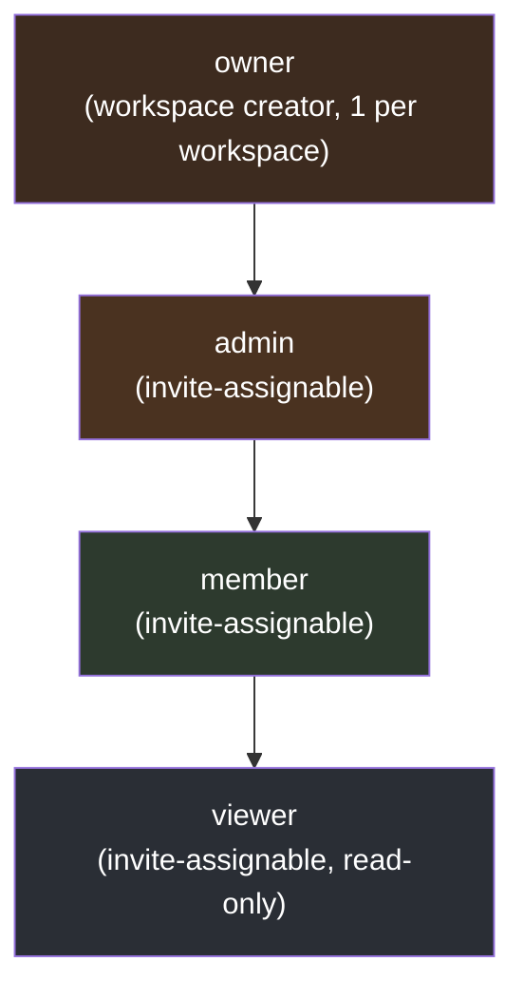

# User Personas — Bunkai (Discovery View)

> Generated by: `/project-discovery` Phase 2, sub-step 2 (User Personas)
> Generated: 2026-08-15
> **Mindset**: personas here are the system roles the authorization code actually recognizes, not invented demographics. Two personas cover the human role hierarchy (`workspace_members.role`); a third covers the machine/agentic caller Bunkai explicitly designs for.

---

## 1. Persona Discovery Summary

| Persona | System Role | Access Level | Primary Goal |
|---|---|---|---|
| Workspace Owner/Admin | `owner` / `admin` (`workspace_members.role`) | Full — member management, PAT admin-scope issuance, workspace settings | Stand up a workspace, manage its members and tokens, own the account relationship |
| QA/Dev Contributor | `member` (`workspace_members.role`) | Read/write on the test-authoring and execution surface; no admin actions | Author ATCs/Tests, execute Runs, file Bugs — the day-to-day product user |
| Read-Only Stakeholder | `viewer` (`workspace_members.role`) | Read-only — coverage, traceability, reports; no create/execute affordances | Monitor quality status without being able to change anything |
| Machine / Agentic Operator | Bearer PAT caller (any scope combination of `atc:read`, `atc:write`, `run:execute`, `workspace:admin`) | Scoped, per-token — same REST surface as a browser user | Drive ATC authoring, Run execution, and coverage queries programmatically (CLI, CI, AI agent) |

**Note on persona count**: 4 personas are documented, one above the "2-4 typical" guidance ceiling, because the machine/agentic caller is not a variant of the human role hierarchy — it is a structurally distinct auth tier (Bearer PAT vs. Supabase session cookie) with its own scope model, and the target product's own docs single it out as Persona "Karim." Collapsing it into "member" would hide the single highest-priority security surface in the whole system (BK-134/135, BK-316 both landed here).

---

## 2. Persona: Workspace Owner/Admin

### Identity

- **System Role**: `owner` (workspace creator, exactly one per workspace, `workspaces.owner_user_id` FK RESTRICT) or `admin` (invite-assignable, `workspace_invites.role` allows `admin` but not `owner`)
- **Evidence**: `staging-dbhub` live schema `workspace_members_role_check` (`viewer | member | admin | owner`); `workspace_invites_role_check` (`viewer | member | admin` — owner is NOT invite-assignable, only the bootstrap creator gets it)
- **Access Level**: Full within the workspace — the only role that can issue `workspace:admin`-scoped PATs (post BK-134/135 fix), manage invites, PATCH workspace settings
- **Estimated % of users**: Not derivable from code — no user-count telemetry exists (see `executive-summary.md` §3)

### Goals (Inferred from Features)

| Goal | Supporting Feature | Route/Component |
|---|---|---|
| Bootstrap a new workspace on first sign-in | Workspace Creation (FEAT-007) | `POST /api/v1/workspaces` → `bunkai_bootstrap_workspace` RPC; `app/(app)/onboarding/page.tsx` |
| Invite teammates with the right role | Workspace Invite Management (FEAT-010) | `POST /api/v1/workspaces/{id}/invites` (`workspace:admin` scope) |
| Issue admin-scoped PATs for trusted CI/agent integrations, safely | PAT Management (FEAT-005) | `POST /api/v1/tokens`; `lib/api/pat.ts` |
| Update workspace settings | Workspace Read & Update (FEAT-008) | `PATCH /api/v1/workspaces/{id}` |

### Pain Points (Inferred from Validation/Errors)

| Pain Point | Evidence |
|---|---|
| Cannot bulk-invite by email domain — invites are one-at-a-time by explicit email | `GET/POST /api/v1/workspaces/{id}/invites` — no bulk-invite endpoint found |
| No delete-workspace API — an owner who wants to fully remove a workspace has no path to do so (leave-only for members) | CRUD Matrix: Workspace Delete = ❌, `business-feature-map.md` §3 |
| Cannot revoke pre-fix `workspace:admin` PATs from the UI in a targeted "revoke all admin-scoped" action — only individual per-token revoke exists | `DELETE /api/v1/tokens/{id}`; see GAP-14 in `executive-summary.md` |

### Feature Access

| Feature | Access | Evidence |
|---|---|---|
| PAT issuance (all scopes incl. `workspace:admin`) | Full | `assertTokenIssuanceAuthorized()` requires admin/owner role for `workspace:admin` scope, `lib/api/pat.ts:53-89` |
| Invite management | Full | `workspace:admin` scope gate |
| ATC/Test/Run authoring & execution | Full (same as `member`) | `role !== 'viewer'` gates |
| Milestone create/edit | Full | `role !== 'viewer'` |

### User Journey Summary

`Sign in → /onboarding (if no workspace) → bootstrap workspace → invite teammates → issue scoped PATs for CI/agents`

### Profile Attributes (from schema)

- `auth.users` (Supabase-managed) — `id`, `email`
- `workspace_members` — `user_id`, `workspace_id`, `role='owner'|'admin'`, `status ∈ {active, invited, suspended}`

### Representative Quote (inferred, flagged as such)

> "I need to know exactly who can mint an admin token before I let a CI pipeline touch this workspace." — *(inferred illustration, not a captured user statement)*

---

## 3. Persona: QA/Dev Contributor

### Identity

- **System Role**: `member` (`workspace_members.role`)
- **Evidence**: `workspace_members_role_check`; every `role !== 'viewer'` gate in the codebase treats `member`/`admin`/`owner` identically for authoring actions
- **Access Level**: Read/write on the product's core surface (ATCs, Tests, Runs, Bugs, Milestones); no admin/PAT-admin actions
- **Estimated % of users**: Not derivable from code (see above)

### Goals (Inferred from Features)

| Goal | Supporting Feature | Route/Component |
|---|---|---|
| Author an ATC anchored to a Story + AC | ATC Builder (FEAT-017) | `components/atcs/NewAtcEditor.tsx`; `POST /api/v1/atcs` |
| Assemble ATCs into a reusable Test chain | Test Builder (FEAT-025) | `components/tests/NewTestBuilder.tsx` |
| Start and execute a Manual Run | Manual Run Start (FEAT-029), Step Result Update (FEAT-030) | `components/tests/StartRunButton.tsx`; `components/runs/RunnerView.tsx` |
| File a Bug from a failed run step | Bug Reporting (FEAT-046) | `components/bugs/BugFormDialog.tsx`, triggered from `RunnerView.tsx:898-912` ("Report bug", member+ only, failed steps) |
| Check whether a Story is actually covered | Traceability Chain Report (FEAT-050) | `components/traceability/TraceabilityChainView.tsx` |

### Pain Points (Inferred from Validation/Errors)

| Pain Point | Evidence |
|---|---|
| "That email or password is incorrect." — generic credential error gives no hint whether the account exists | `app/(auth)/login/email-first-form.tsx:123` |
| "Verify your email with the code we sent before signing in." — mandatory OTP blocks sign-in with no bypass, even for a legitimate returning user who lost the code | `email-first-form.tsx:119`; resend exists (`.../resend`) but no alternate path |
| ATC creation rejected pre-transaction if the referenced AC doesn't belong to the given Story — exact error message not directly observed this pass (Discovery Gap, `domain-glossary.md` §8) | `bunkai_create_atc` RPC pre-check |
| "Too many attempts. Please wait a moment and retry." — rate-limit friction on every auth step (check-email, signin, signup, confirm, resend) | `email-first-form.tsx:73,113,155,188,228` |

### Feature Access

| Feature | Access | Evidence |
|---|---|---|
| ATC/Test authoring | Full | `role !== 'viewer'` |
| Run start/mark/abort/finish | Full | `StartRunButton.tsx` comment: "Member+ only" |
| Bug filing | Full | `RunnerView.tsx:116` comment: "viewers get no 'Report bug' affordance at all" (implying member+ does) |
| PAT admin-scope issuance | None | `assertTokenIssuanceAuthorized()` blocks non-admin/owner for `workspace:admin` scope |
| Workspace settings / invites | None | `workspace:admin`-gated routes reject |

### User Journey Summary

`Sign in → open a Project → author/edit an ATC → assemble a Test → start a Run → mark steps → file a Bug on failure → finish Run`

### Profile Attributes (from schema)

- `workspace_members` — `role='member'`, `status='active'`
- `access_tokens` — auto-minted `DEFAULT_PAT_SCOPES` PAT on sign-in/sign-up/confirm (excludes `workspace:admin`)

### Representative Quote (inferred, flagged as such)

> "I just failed a step — let me file the bug right from here without losing the run context." — *(inferred illustration, not a captured user statement)*

---

## 4. Persona: Read-Only Stakeholder

### Identity

- **System Role**: `viewer` (`workspace_members.role`)
- **Evidence**: `workspace_members_role_check`; every `role !== 'viewer'`/`canCreate`/`canEdit` gate explicitly excludes this role
- **Access Level**: Read-only across the product — sees coverage %, traceability chains, reports; every "New"/"Start Run"/"Report bug" affordance is hidden, not just disabled
- **Estimated % of users**: Not derivable from code

### Goals (Inferred from Features)

| Goal | Supporting Feature | Route/Component |
|---|---|---|
| Check project quality status without needing edit rights | Project Coverage Dashboard (FEAT-057), Home Dashboard (FEAT-056) | `components/coverage/ProjectCoverageView.tsx` |
| Read the traceability chain for a Story | Traceability Chain Report (FEAT-050) | `GET /api/v1/projects/{id}/traceability` — read-only for all roles including viewer |
| Follow Bug status without being able to reassign | Bug List & Filtering (FEAT-047) | `components/bugs/BugsListView.tsx` — list/filter available, assign/status-transition controls hidden |

### Pain Points (Inferred from Validation/Errors)

| Pain Point | Evidence |
|---|---|
| No "New Milestone" button — sees a read-only note instead | `business-feature-map.md` FEAT-055: "viewers see a read-only note instead of the New button" |
| Cannot start a Run even to re-verify a fix — `StartRunButton.tsx` is member+ gated, viewers never see it | `components/tests/StartRunButton.tsx` header comment |
| Cannot file a Bug directly from a failed step they're viewing | `components/runs/RunnerView.tsx:116` |

### Feature Access

| Feature | Access | Evidence |
|---|---|---|
| Read (ATCs, Tests, Runs, Bugs, Traceability, Coverage) | Full | RLS scopes to workspace membership regardless of role; UI shows read views to all roles |
| Create/edit (ATC, Test, Milestone, Run start, Bug file) | None | `role !== 'viewer'` gate, checked in ≥4 separate components (`layout.tsx:69`, `milestones/page.tsx:66`, `bugs/page.tsx:87`, `StartRunButton.tsx`) |
| Bug assign/status transition | None | Inferred — no evidence of a viewer-visible assign control found this pass; flagged as Discovery Gap below (not directly re-verified against `BugsListView.tsx` role branching) |

### User Journey Summary

`Sign in → open a Project → read Coverage/Traceability/Bug list → (no write actions available)`

### Profile Attributes (from schema)

- `workspace_members` — `role='viewer'`, `status='active'`
- `workspace_invites` — `role` CHECK allows `viewer` as an invite-assignable role

### Representative Quote (inferred, flagged as such)

> "I just need to see if this story is actually covered before sign-off — I don't need to touch anything." — *(inferred illustration, not a captured user statement)*

---

## 5. Persona: Machine / Agentic Operator

### Identity

- **System Role**: Bearer PAT caller (`access_tokens` row, prefix `bk_pat_*`), not a `workspace_members.role` value — scopes are the access model here, not a role
- **Evidence**: `access_tokens.scopes` CHECK `∈ {atc:read, atc:write, run:execute, workspace:admin}`; `business-api-map.md` §2 names this caller type explicitly and cross-references the target's own Persona "Karim" (AI-operator/agentic consumption as a first-class design goal)
- **Access Level**: Scoped per-token, independent of the underlying human's `workspace_members.role` (though issuance is role-gated — see BR/BK-134/135 below)
- **Estimated % of users**: Not derivable from code; strategically important per `business-model.md` (targeted customer segment: "QA-quality-engineering training audience," CI/CD pipelines)

### Goals (Inferred from Features)

| Goal | Supporting Feature | Route/Component |
|---|---|---|
| Authenticate headlessly and receive a working PAT in the same response | Password Sign-in (FEAT-002), Email Sign-up+OTP (FEAT-003) | `POST /api/v1/auth/signin`/`.../confirm` — auto-mints `DEFAULT_PAT_SCOPES` |
| Author/edit ATCs via REST identically to a browser user | ATC REST API (FEAT-016) | `POST /api/v1/atcs`, `PATCH /api/v1/atcs/{id}` with `X-If-Match` optimistic lock |
| Start and drive a Run without a UI | Manual Run Start (FEAT-029) | `POST /api/v1/runs` — `Idempotency-Key` header REQUIRED, `run:execute` scope |
| Manage its own credential hygiene | PAT lifecycle (FEAT-005) | `GET/POST /api/v1/tokens`, `DELETE /api/v1/tokens/{id}` |

### Pain Points (Inferred from Validation/Errors)

| Pain Point | Evidence |
|---|---|
| A PAT cannot mint another PAT — hard `403 forbidden` if attempted | `business-api-map.md` §2: "PATs cannot mint PATs" |
| `POST /runs` hard-fails without an `Idempotency-Key` header — a behavior change from an earlier "planned, unwired" state; a caller that doesn't send it gets a hard failure, not a soft no-op | GAP-15, `business-api-map.md` §7 |
| A PAT cannot switch its bound workspace — `POST /me/active-workspace` returns a hard `403` for Bearer callers (BK-316 fix); an agent must be re-issued a new PAT to act in a different workspace | `app/api/v1/me/active-workspace/response.ts:42-49` |
| A member-role identity cannot self-issue a `workspace:admin`-scoped PAT even via the API — requires admin/owner (BK-134/135 fix) | `lib/api/pat.ts:53-89` |

### Feature Access

| Feature | Access | Evidence |
|---|---|---|
| ATC read/write | Per-scope (`atc:read`/`atc:write`) | `access_tokens.scopes` gate on every ATC/Test route |
| Run execution | Per-scope (`run:execute`) | Gate on `POST /runs` and step-mark routes |
| Workspace admin actions (PAT issuance, invites, settings) | Per-scope (`workspace:admin`), issuance itself role-gated | `assertTokenIssuanceAuthorized()`, `assertNoGlobalAdminScope()` |
| Workspace switching | None (structurally — 403 always) | BK-316 fix, Journey 5 in `business-api-map.md` |

### User Journey Summary

`POST /auth/signin (or signup+confirm) → receive session + PAT → Bearer-authenticate every subsequent REST call → author ATCs / start+drive Runs / query coverage`

### Profile Attributes (from schema)

- `access_tokens` — `id`, `token_prefix`, `token_hash`, `scopes[]`, `workspace_id` (nullable only for non-admin scopes, hard-blocked for admin), `revoked_at`, `last_used_at`

### Representative Quote (inferred, flagged as such)

> "I don't have a browser — give me a token, a scope, and a predictable JSON envelope, and I'll drive the whole test cycle myself." — *(inferred illustration, not a captured user statement)*

---

## 6. Role Hierarchy

Source: `domain-glossary.md` §2 (`workspace_members.role` CHECK, "Role hierarchy: `viewer ⊂ member ⊂ admin ⊂ owner`"). This is a **strictly nested access hierarchy** (each tier's permissions are a superset of the tier below), not a set of laterally distinct roles — confirmed by every `role !== 'viewer'` gate found treating `member`/`admin`/`owner` identically for authoring actions. `owner` is not invite-assignable (`workspace_invites_role_check` allows only `viewer | member | admin`) — it exists only for the workspace's bootstrap creator.

The Machine/Agentic Operator persona is orthogonal to this hierarchy (a scope model on top of, not inside, the role tree) and is not shown as a node in it.

---

## 7. Permission Matrix

| Permission | Owner/Admin | QA/Dev Contributor (member) | Read-Only Stakeholder (viewer) | Machine Operator (PAT) |
|---|---|---|---|---|
| Read ATCs/Tests/Runs/Bugs/Traceability/Coverage | ✅ | ✅ | ✅ | ✅ (per `atc:read` scope) |
| Author/edit ATC | ✅ | ✅ | ❌ | ✅ (per `atc:write` scope) |
| Assemble/edit Test chain | ✅ | ✅ | ❌ | ✅ (per `atc:write` scope) |
| Start/mark/abort/finish Run | ✅ | ✅ | ❌ | ✅ (per `run:execute` scope) |
| File a Bug | ✅ | ✅ | ❌ | ✅ (per `atc:write` scope) |
| Create/edit Milestone | ✅ | ✅ | ❌ | ⚠️ Not verified this pass — no scope maps explicitly to Milestones in the 4-scope model; Discovery Gap |
| Issue `workspace:admin`-scoped PAT | ✅ | ❌ | ❌ | ❌ (a PAT can never mint another PAT, any scope) |
| Manage workspace invites | ✅ | ❌ | ❌ | ✅ (per `workspace:admin` scope, if held) |
| Switch active workspace | ✅ (session only) | ✅ (session only) | ✅ (session only) | ❌ (hard 403, always — BK-316) |
| PATCH workspace settings | ✅ | ❌ | ❌ | ✅ (per `workspace:admin` scope, if held) |

Legend: ✅ Full · ❌ Not available · ⚠️ Unconfirmed this pass

---

## 8. Discovery Gaps

| Gap | Why It Matters | Question to Ask |
|---|---|---|
| Viewer's exact visibility into Bug assign/status controls not directly re-verified against `BugsListView.tsx` role branching this pass | A permission-matrix cell (Bug assign) is inferred, not directly observed | Read `components/bugs/BugsListView.tsx` role-conditional rendering directly |
| No scope maps explicitly to Milestone create/edit in the 4-scope PAT model (`atc:read`, `atc:write`, `run:execute`, `workspace:admin`) | Unclear whether a machine caller can manage Milestones at all, or whether this is a UI-only feature | Check `POST /api/v1/projects/{id}/milestones` route's `requires: [...]` scope declaration directly |
| Estimated % of users per persona is not derivable — no usage telemetry exists anywhere in the product | Cannot prioritize QA effort by persona traffic volume | Ask the team for any external usage data (support tickets, sales calls) since the product has none in-app |
| CRUD Matrix flags Workspace Member role-change as unconfirmed (`business-feature-map.md` §3) | Unknown whether an Admin can promote a `viewer` to `member` post-invite, or only at invite time | Read the `workspace_members` PATCH/role-change route directly if one exists |

---

## 9. QA Relevance

### Test Account Requirements

| Persona | Test Account (`.env` key) | Permissions Needed | Status |
|---|---|---|---|
| Owner/Admin (workspace creator) | `STAGING_USER_EMAIL` / `STAGING_USER_PASSWORD` (also `LOCAL_USER_*`) | Owner of the BK-264 sandbox workspace — confirmed by code comment `// matches STAGING_USER_EMAIL` next to `BK264_SANDBOX_OWNER_USER_ID` in `tests/integration/bugs/*.test.ts` | **Mapped** — provisioned on `staging`; `local` slot exists in `.env.example` but is empty by default (per-developer setup) |
| QA/Dev Contributor (member) | `STAGING_MEMBER_EMAIL` / `STAGING_MEMBER_PASSWORD` (also `LOCAL_MEMBER_*`) | `member` role in the same sandbox workspace | **Mapped** — provisioned on `staging` as of BK-264 (`config/variables.ts:116`: "only staging has them provisioned as of BK-264") |
| Read-Only Stakeholder (viewer) | `STAGING_VIEWER_EMAIL` / `STAGING_VIEWER_PASSWORD` (also `LOCAL_VIEWER_*`) | `viewer` role in the same sandbox workspace | **Mapped** — provisioned on `staging` as of BK-264 |
| Machine/Agentic Operator | No dedicated `.env` key — a PAT is minted at test-runtime via `bun run api:login [env] [--role <role>]`, written to `.auth/tokens.env` (gitignored), not stored as a static credential | Any of the 4 scopes, depending on the test | **Needs no separate account** — reuses the human identities above (`STAGING_USER_*`/`STAGING_MEMBER_*`) to mint a PAT on demand; this is the designed flow (`api-testing-doctrine.md`), not a gap |
| Admin-only (distinct from owner) | No dedicated `.env` key exists for a pure `admin`-role (non-owner) identity | Would only matter if a test specifically needs to distinguish `admin` from `owner` behavior (e.g. the one action reserved to `owner` only — none confirmed to exist this pass) | **Needs creation** only if a future TC requires `admin`≠`owner` distinction; not currently needed since no owner-only-not-admin gate was found in this pass |

### Critical Persona Flows to Test

- Owner/Admin: PAT issuance role-gate (BK-134/135 regression) — member-role self-issuance of `workspace:admin` must return 403.
- QA/Dev Contributor: full authoring→execution→bug-filing loop (ATC → Test → Run → mark → Bug).
- Read-Only Stakeholder: every create/execute affordance must be absent from the DOM (not just disabled) — verify via UI snapshot, not just an API 403.
- Machine Operator: workspace-switch attempt via Bearer must always 403 (BK-316 regression); `Idempotency-Key` omission on `POST /runs` must hard-fail.

### Edge Cases by Persona

- Viewer attempting a direct API call (bypassing the hidden UI) to a `role !== 'viewer'`-gated endpoint — must be rejected server-side, not just hidden client-side.
- A `member`-role PAT attempting to escalate by requesting `workspace:admin` scope at `POST /api/v1/tokens` — must 403.
- An `admin`-scoped PAT attempting to act in a workspace other than the one it was minted for — must be rejected by `assertWorkspaceContext()` even though the underlying human may administer multiple workspaces.
