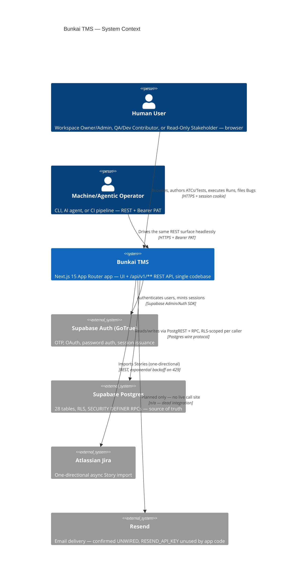
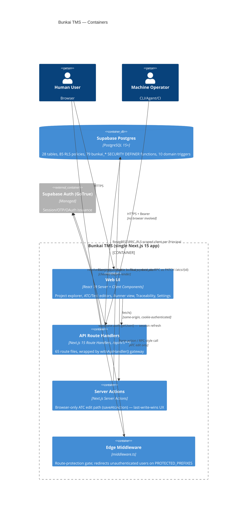
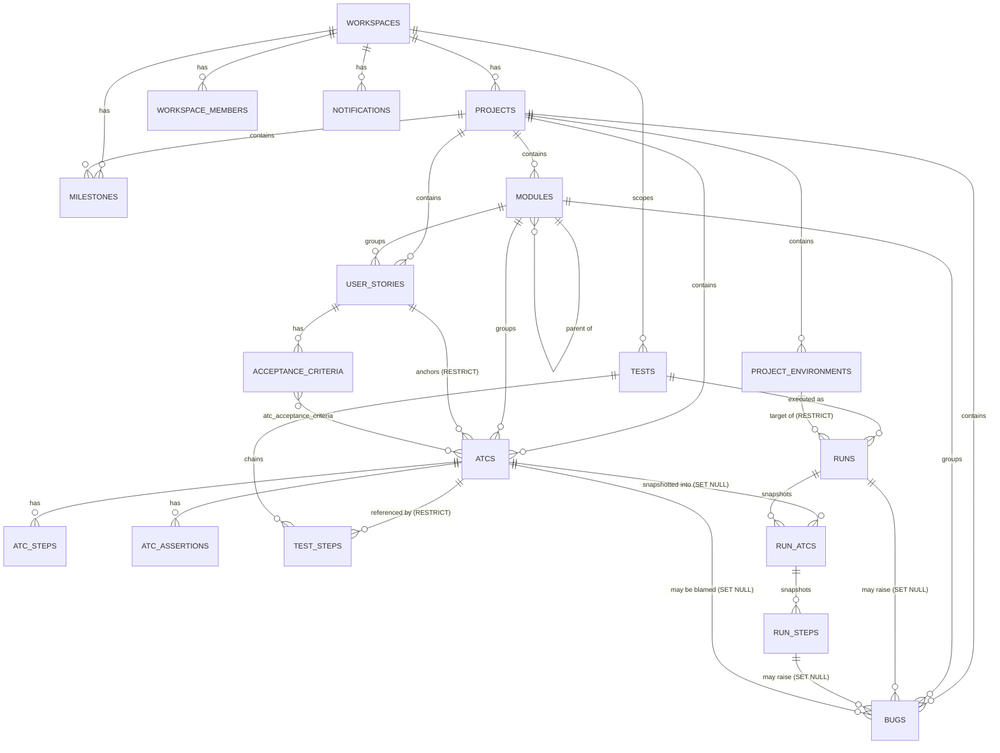
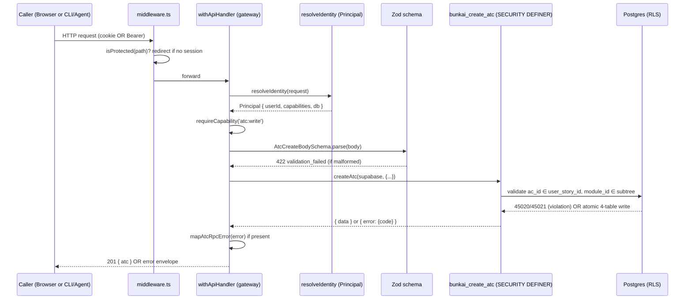
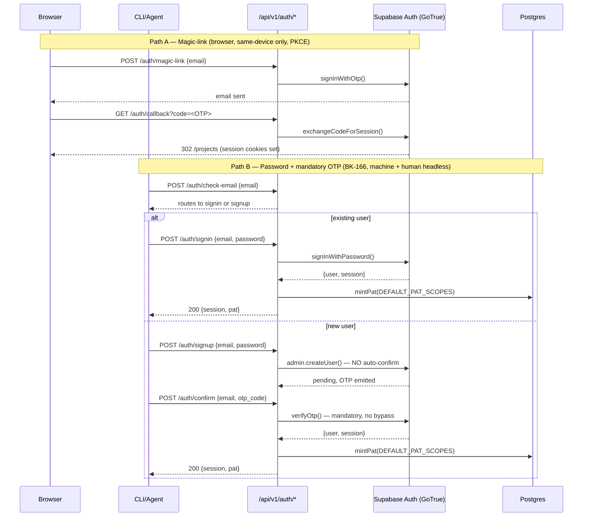

# SRS — Architecture: Bunkai TMS

> Generated by: `/project-discovery` Phase 2, sub-step 4 (SRS — Architecture)
> Generated: 2026-08-15
> Target repo assessed: `upex-bunkai-tms` at `staging` HEAD (`de670c4`)
> Sources: direct code reads (`middleware.ts`, `lib/api/*`, `next.config.ts`, `package.json`, `.env.example`), live `staging` Postgres schema via `staging-dbhub` MCP (`pg_policies`, `pg_trigger`, `pg_proc`, `pg_indexes`, `information_schema.tables`), plus pre-existing `bunkai-qa-engineering/.context/business/{domain-glossary,business-api-map}.md` and `.context/project-config.md`.
> **Mindset**: every component/diagram below is read from shipped code or a live query, not the target's own architecture docs (those are informative cross-references only, cited where they corroborate).

---

## 1. System Overview

Bunkai is a **single Next.js 15 App Router application** serving both the browser UI and a versioned REST API (`/api/v1/**`) from one codebase — there is no separate backend service, no API gateway, and no monorepo split (confirmed: no `pnpm-workspace.yaml`/`turbo.json`/`nx.json` at repo root). Business logic that requires atomicity or cross-tenant safety is pushed into **Postgres SECURITY DEFINER RPCs** (79 `bunkai_*` functions confirmed live via `pg_proc`) rather than the TypeScript layer — the app is a thin orchestration shell over the database's own authority.

**Architectural pattern**: Modular monolith, feature-sliced. `app/api/v1/<domain>/route.ts` (65 route files across 20 domains) mirrors `lib/<domain>/` (33 domain folders: `atcs`, `runs`, `bugs`, `tests`, `workspaces`, etc.) which mirrors `components/<domain>/` (16 UI domains). No MVC layering, no repository pattern, no ORM — the Supabase JS client talks directly to PostgREST/RPC.

### Tech stack

| Layer | Technology | Evidence |
|---|---|---|
| Frontend framework | Next.js 15 (App Router), React 19, TypeScript 5.9 (strict) | `package.json`: `"next": "^15"`, `"react": "^19"`, `tsconfig.json` |
| Styling | Tailwind CSS 3.4, Radix UI primitives, `cmdk`, `class-variance-authority` | `package.json` |
| Editor/rendering | `@monaco-editor/react` (step editor), `react-markdown` + `rehype-sanitize` + `remark-gfm` (Markdown render/sanitize) | `package.json` |
| Backend | Next.js 15 Route Handlers (`app/api/v1/**/route.ts`), no Express/NestJS layer | `business-api-map.md` §1; confirmed by `find app/api/v1 -name route.ts \| wc -l` = 65 |
| API contract generation | `@asteasolutions/zod-to-openapi` (Zod schemas → OpenAPI 3.x), `@scalar/api-reference-react` (interactive docs UI) | `package.json`; `lib/openapi/registry.ts` |
| Validation | Zod 4.4.3 (request bodies), Postgres CHECK constraints + SECURITY DEFINER RPC pre-checks (domain invariants) | `lib/atcs/validation.ts`, `lib/runs/validation.ts`, `lib/bugs/validation.ts` |
| Data access | `@supabase/supabase-js` + `@supabase/ssr` — direct PostgREST/RPC calls, **no ORM** | `project-config.md` |
| Database | PostgreSQL via Supabase (hosted) — 28 tables, 85 RLS policies, 10 app-domain triggers (+5 storage/realtime-internal), 79 `bunkai_*` functions | live `staging` query (§5 below) |
| Auth | Supabase Auth (GoTrue) — magic-link (PKCE), password + mandatory OTP (BK-166), OAuth (Google/GitHub, UI trigger unconfirmed), Bearer PAT (`bk_pat_*`) | `business-api-map.md` §2 |
| Hosting | Vercel (inferred — `webapp_domain: upexbunkai.vercel.app`), Supabase Cloud | `project-config.md`; no `vercel.json` found (unconfirmed deploy trigger) |
| CI/CD | **None** — no `.github/workflows/`, no `vercel.json` | `project-config.md` Discovery Gaps |

---

## 2. C4 Context Diagram



---

## 3. C4 Container Diagram



---

## 4. Component Structure

### Directory layout (top-level, annotated)

```
upex-bunkai-tms/
├── app/                          # Next.js App Router — pages + API routes
│   ├── (app)/                    # Protected route group (behind middleware gate)
│   │   ├── home/ onboarding/ projects/ settings/ workspaces/ activity/
│   ├── (auth)/login/             # Public — 3-step email-first auth state machine
│   ├── api/
│   │   ├── v1/                   # 20 domain folders, 65 route.ts handlers — the REST surface
│   │   ├── docs/                 # Scalar interactive OpenAPI UI (GET /api/docs)
│   │   └── openapi/              # JSON spec endpoint (GET /api/openapi)
│   ├── auth/callback/            # Magic-link + OAuth code-exchange (route handler, not a page)
│   ├── about/ design-tokens/ qa/ # Marketing, design-system reference, internal testability guide
│   └── invites/accept/           # Invite-redemption landing
├── components/                   # 16 domain folders — presentational + client-interactive UI
│   ├── atcs/ bugs/ runs/ tests/ traceability/ milestones/ coverage/ metrics/
│   ├── layout/ notifications/ settings/ home/ activity/ markdown/ providers/ ui/
├── lib/                          # 33 domain folders — business logic, mirrors app/api/v1 + components
│   ├── api/                      # Cross-cutting: handler.ts (gateway), principal.ts (identity),
│   │                             #   pat.ts, idempotency.ts, error-envelope.ts, middleware/bearer.ts
│   ├── atcs/ runs/ bugs/ tests/ workspaces/ modules/ user-stories/ ... # domain logic + Zod schemas + RPC error mappers
│   ├── supabase/                 # Client factories: server (SSR), admin (service-role)
│   ├── openapi/                  # zod-to-openapi registry
│   └── jira/                     # Jira import client (exponential backoff on 429)
├── middleware.ts                 # Single edge gate — route protection only, no other cross-cutting concern
├── next.config.ts                # Minimal — no headers(), no CSP, no custom webpack config
└── supabase/migrations/*.sql     # Raw SQL migrations — no ORM migration tool
```

### Component responsibility table

| Component | Role | Why it matters for QA |
|---|---|---|
| `middleware.ts` | Edge-layer route gate — redirects unauthenticated users off `PROTECTED_PREFIXES` to `/login?next=...` | The ONLY cross-cutting concern at this layer. No rate limiting, no security headers, no logging here. |
| `lib/api/handler.ts` (`withApiHandler`) | Unified API gateway: request-id propagation, structured access log, centralised error mapping (`ApiError`/`ZodError`/unknown → envelope), secure-by-default auth resolution | Every route's error shape and auth requirement is decided here, not per-route — a single point to verify the envelope contract holds. |
| `lib/api/principal.ts` (`resolveIdentity`) | Collapses cookie session and Bearer PAT into one `Principal` type; mints a short-lived per-user JWT for PAT→RLS impersonation | Structural cookie/PAT parity — any route tested with one auth scheme should behave identically with the other, by design. |
| `lib/api/middleware/bearer.ts` | Bearer PAT verification — prefix lookup, hash compare, expiry/revocation check, `last_used_at` touch | All failures collapse to a uniform 401 (never leaks which check failed) — an enumeration-resistance design worth testing directly. |
| `lib/api/pat.ts` | PAT issuance authorization (`assertTokenIssuanceAuthorized`, `assertNoGlobalAdminScope`) | The BK-134/135 fix lives here — role-gates `workspace:admin` scope issuance. |
| `lib/api/idempotency.ts` | HTTP-level `Idempotency-Key` replay guard (distinct from the domain-level `start_token` 24h window inside `bunkai_create_run`) | Two independent idempotency layers exist for Run start — a test should exercise both, not conflate them. |
| `lib/api/error-envelope.ts` | Canonical `{ error: { code, message, details?, request_id? } }` shape + `ApiError` class with ~25 domain-specific codes | Every negative-test assertion should branch on `error.code`, never on `error.message` text. |
| `app/api/v1/**/route.ts` (65 files, 20 domains) | REST handlers — thin: parse (Zod) → call RPC → map RPC error → respond | Where the top-5 critical flows (§ functional-specs) are entered. |
| `lib/<domain>/validation.ts` | Zod request-body schemas per domain — first validation layer, mirrors (but does not replace) the RPC's own re-validation | "Two-layer" validation is a repeated pattern — a malformed body fails fast at 422 before any DB round-trip. |
| `lib/<domain>/errors.ts` (`map*RpcError`) | Maps Postgres SQLSTATE / custom `45xxx` error codes raised inside `bunkai_*` RPCs to the canonical `ApiError` envelope | The RPC is the actual enforcement point of record; this file is where the DB's refusal becomes an HTTP-visible code — read this before writing any negative-test assertion against a specific `error.code`. |
| `app/(app)/projects/[projectSlug]/atcs/[atcId]/actions.ts` (`saveAtcAction`) | The one Server Action still in the write path — browser-only ATC edit, calls the SAME `bunkai_update_atc` RPC as the REST `PATCH` | Only structural difference from the REST edit path: no `X-If-Match` (last-write-wins for the browser, by design). |
| `supabase/migrations/*.sql` | Raw SQL — schema, RLS policies, triggers, `bunkai_*` RPCs | Source of truth for every CHECK constraint / RPC error code cited in functional-specs. |

---

## 5. Database Schema

### Live schema facts (queried directly, `staging-dbhub` MCP)

| Metric | Value | Query |
|---|---|---|
| Base tables (`public` schema) | 28 | `information_schema.tables WHERE table_schema='public' AND table_type='BASE TABLE'` |
| RLS policies (`public` schema) | 85 | `pg_policies WHERE schemaname='public'` |
| Domain triggers (non-internal) | 10 app-domain (+5 Supabase storage/realtime-internal: `protect_buckets_delete`, `enforce_bucket_name_length_trigger`, `update_objects_updated_at`, `protect_objects_delete`, `tr_check_filters`) | `pg_trigger t JOIN pg_class c ON t.tgrelid=c.oid WHERE NOT tgisinternal` |
| `bunkai_*` functions (SECURITY DEFINER RPCs + helpers) | 79 | `pg_proc WHERE proname LIKE 'bunkai_%'` |

**RLS coverage is comprehensive, not partial**: all 28 tables carry at least 1 policy; most write-surfaced tables carry 3-4 (SELECT/INSERT/UPDATE/DELETE split), gated through two shared predicate functions confirmed live: `bunkai_is_workspace_member(workspace_id)` (read gate) and `bunkai_can_write_workspace(workspace_id)` (write gate — role ≥ `member`). Example (`atcs` table, read directly from `pg_policies`):

```sql
-- atcs_select_workspace_member (SELECT)
EXISTS (SELECT 1 FROM projects p WHERE p.id = atcs.project_id AND bunkai_is_workspace_member(p.workspace_id))

-- atcs_update_workspace_role_member_plus (UPDATE)
EXISTS (SELECT 1 FROM projects p WHERE p.id = atcs.project_id AND bunkai_can_write_workspace(p.workspace_id))
```

### 10 app-domain triggers (confirmed live, not paraphrased)

| Trigger | Table | Purpose |
|---|---|---|
| `bugs_check_consistency` | `bugs` | BEFORE INSERT/UPDATE — validates `run_step_id`/`atc_id`/`run_id`/`project_id` genuinely belong together (BR-03) |
| `activity_log_notify_bug_event` | `activity_log` | Fires a Notification row on bug lifecycle events |
| `activity_log_notify_run_event` | `activity_log` | Fires a Notification row on run lifecycle events (`run.finished`/`run.aborted`) |
| `atcs_refresh_tsv` | `atcs` | Maintains the `tsv` full-text-search column on write |
| `atcs_set_updated_at`, `bugs_set_updated_at`, `milestones_set_updated_at`, `notification_preferences_set_updated_at`, `runs_set_updated_at`, `tests_set_updated_at` | respective tables | Generic `updated_at` timestamp maintenance |

### Entity Relationship Diagram

> Reused/adapted from `bunkai-qa-engineering/.context/business/domain-glossary.md` §4 — same live `pg_constraint` source, cross-checked against `business-data-map.md` §2 (no drift found this pass).



Full column-level detail (key attributes, CHECK constraints, FK cascade rules) lives in `bunkai-qa-engineering/.context/business/domain-glossary.md` §1 — not duplicated here to avoid drift; that document is grounded in the same live schema query.

### Indexes (evidence, not exhaustive — 60+ non-PK indexes found)

Representative pattern: every high-cardinality list view has a matching composite index, several **partial** (predicate-filtered):

| Table | Index | Pattern |
|---|---|---|
| `atcs` | `atcs_tsv_gin_idx` (GIN on `tsv`) | Full-text search backing `bunkai_search_atcs` |
| `atcs` | `atcs_project_id_updated_at_idx` `WHERE archived_at IS NULL` | Partial index — list view excludes archived rows without a runtime filter cost |
| `bugs` | `bugs_workspace_id_severity_unresolved_idx` `WHERE status IN ('open','in_progress')` | Partial index tuned for the Home "open bugs" widget |
| `bugs` | `bugs_project_id_severity_created_at_id_idx` | Composite, keyset-pagination-shaped (`created_at DESC, id DESC`) |
| `runs` | `runs_workspace_id_started_at_running_idx` `WHERE status='running'` | Partial index for the Home "active runs" widget |
| `notifications` | `notifications_recipient_workspace_unread_idx` `WHERE read_at IS NULL` | Partial index for the unread-badge count |
| `idempotency_keys` | `idempotency_keys_user_id_endpoint_key_key` (UNIQUE) | Backs the HTTP-level replay guard |
| `import_jobs` | `import_jobs_one_active_per_project` (UNIQUE, partial `WHERE status IN ('queued','running')`) | DB-enforced "one active Jira import per project" invariant |

---

## 6. Data Flow

### Request sequence (authenticated write — POST /api/v1/atcs)



### Auth sequence — dual path (magic-link primary, password+OTP machine path)



---

## 7. External Services

| Service | Trigger / Evidence | Direction | Wired? | Failure mode |
|---|---|---|---|---|
| Supabase Auth (GoTrue) | `.env.example`: `NEXT_PUBLIC_SUPABASE_URL`, `SUPABASE_PUBLISHABLE_KEY`, `SUPABASE_SECRET_KEY`, `SUPABASE_JWT_SECRET`; `lib/supabase/server.ts`, `lib/api/user-jwt.ts` | Outbound sync | ✅ Live | 429 rate-limit passthrough (`ApiError('rate_limited', ..., {status:429})` in `check-email`, `signup`, `signin`, `confirm`, `magic-link`, `resend` routes) — this IS Bunkai's only rate-limit surface, borrowed from Supabase, not self-implemented |
| Supabase Postgres (RLS) | `POSTGRES_*` env vars; every `createClient()`/`createAdminClient()` call | Internal | ✅ Live | RLS miss → empty result set or explicit 403 from `mapXRpcError` |
| Atlassian Jira | `.env.example`: `ATLASSIAN_URL`, `ATLASSIAN_EMAIL`, `ATLASSIAN_API_TOKEN`; `lib/jira/client.ts` | Outbound async | ✅ Live — `POST /api/v1/imports` | Per-issue errors surfaced individually, not job-level failure; exponential backoff on 429 (`retryDelayMs()`, honors `Retry-After` header) |
| Resend (email) | `.env.example`: `RESEND_API_KEY` | Planned only | ❌ **Not wired** — zero call sites found in app code | Invite links returned in API response body only (`accept_url`), never emailed |
| Sentry / PostHog | Described in the target's own architecture docs | — | ❌ **Not implemented** — zero packages in `package.json`, zero init code | No error-tracking/analytics visibility during a QA session |
| Tavily | `.env.example`: `TAVILY_API_KEY` | — | Dev-tooling only (AI-agent web search for the repo's own Claude/opencode config), **not a runtime app dependency** — excluded from the product's own external-service surface |

---

## 8. Security Architecture

### Authentication

- **Two auth schemes, one `Principal` type.** `lib/api/principal.ts` `resolveIdentity()` tries Bearer first (never shadowed by a stale cookie), falls back to Supabase SSR session cookie. Both collapse into an identical `Principal { userId, workspaceId, capabilities, via, tokenId, db }` — no route branches on how the caller authenticated (ADR-0001, per code comment).
- **Bearer PAT format**: `bk_pat_<12-char prefix>.<secret>`. Server stores `SHA-256(secret)` in a **sibling table** `access_token_secrets` (NOT on `access_tokens` itself) — "so QA/analytics roles with read access to `access_tokens` cannot read it" (code comment, `lib/api/middleware/bearer.ts`). O(1) prefix lookup, then hash compare, then expiry/revocation check.
- **Uniform 401 on every Bearer failure** — missing header, malformed shape, unknown prefix, hash mismatch, revoked, expired all collapse to the same `unauthorized` error, never disclosing which check failed.
- **Cookie session** — Supabase SSR (`@supabase/ssr`), refreshed by `middleware.ts` on every request via `supabase.auth.getUser()` before any route logic runs (explicit "do not run any logic between createServerClient and getUser" comment).
- **PAT → RLS impersonation**: a Bearer caller's data access runs through an anon Supabase client carrying a short-lived per-user JWT (`mintUserJwt()`, `SUPABASE_JWT_SECRET`) — never the service-role key — so `auth.uid()` resolves identically to a cookie session and RLS applies uniformly (`impersonatingClient()` in `principal.ts`).

### Authorization

- **Capability model** (PAT-only, cookie sessions hold the full set): `atc:read`, `atc:write`, `run:execute`, `workspace:admin`. Enforced route-by-route via `withApiHandler(handler, { requires: [...] })`.
- **`assertWorkspaceContext()`** — re-checks an admin-scoped PAT's workspace binding on **every call**, not just at mint time; a token scoped to workspace A cannot act on workspace B even if the underlying human administers multiple workspaces.
- **RLS as the actual authorization boundary** — 85 policies across all 28 tables, gated through two shared predicate functions (`bunkai_is_workspace_member`, `bunkai_can_write_workspace`) confirmed live. The TypeScript layer does not re-implement access checks; Postgres is the source of truth (per `principal.ts`'s own header comment).
- **PAT issuance is role-gated** (BK-134/135 fix, `lib/api/pat.ts`): `workspace:admin` scope requires active membership + `admin`/`owner` role in the SPECIFIC target workspace (`assertTokenIssuanceAuthorized`); headless auto-mint paths hard-reject any `workspace:admin` request (`assertNoGlobalAdminScope`).
- **Non-disclosure pattern, repeated across domains**: cross-workspace/foreign/missing entity lookups collapse to the SAME `not_found` (never `forbidden`) — confirmed for Traceability (`business-feature-map.md` FEAT-050) and for Bug assign/status-transition (`lib/bugs/errors.ts` comment: "a missing bug and a bug in a workspace the caller isn't even a member of collapse into the SAME not-found"). Deliberate anti-enumeration design, not an oversight.

### Data protection

- **Evidence-URL scheme allowlist (XSS fix, BK-337/TQ5)**: `lib/bugs/validation.ts` tightened `evidence_urls` from a bare `z.string().url()` (which accepted `javascript:`/`data:` schemes) to `z.url({ protocol: z.regexes.httpProtocol })` — explicit http/https-only allowlist at filing time. A companion render-time allowlist (`isHttpUrl`, `lib/utils/url.ts`) is the load-bearing control for rows stored **before** this fix — both layers are worth a dedicated regression test.
- **Markdown sanitization**: `rehype-sanitize` in the render pipeline (`react-markdown` + `remark-gfm` + `rehype-sanitize`) for ATC/Story/AC Markdown bodies. Filing-time content-length budget (`MAX_ATC_CONTENT_BYTES = 2048`, measured in UTF-8 bytes via a custom `byteLength()` — not Zod `.max()`, which counts UTF-16 units, to measure multibyte input consistently).
- **DB-layer integrity backstops that survive an app-layer bypass**: `bugs_check_consistency` trigger (BR-03), `runs_abort_reason_chk` CHECK constraint (BR-02), `modules_path_depth_max_6` CHECK constraint (BR-05) — each independently re-verified by the domain-glossary's Given/When/Then. Not re-derived here to avoid duplication.
- **Secret handling**: `.env` pattern only — no secret manager (Vault, AWS Secrets Manager, Doppler) found in `package.json` or code. `SUPABASE_SECRET_KEY`/`SUPABASE_JWT_SECRET` are process-env values, standard for a Vercel deployment but not independently verified as encrypted-at-rest on the hosting side (Discovery Gap).
- **No hardcoded-secret risk found** — corroborated by the target repo's own Phase-1 assessment (`CLAUDE.md` "Project Assessment (Phase 1)"): a secret-sweep grep returned only confirmed false positives.

### TLS / transport

- No in-app TLS termination logic — inherited from Vercel's edge (HTTPS by default for `*.vercel.app`), not independently verified this pass (no `vercel.json` to confirm forced-HTTPS redirect behavior).

---

## 9. Performance Hooks

| Mechanism | Implementation | Evidence |
|---|---|---|
| In-process TTL memo cache (Home coverage rollup) | Plain `Map<string, {expiresAt, value}>`, per-serverless-instance, **not** a shared cache (explicitly NOT Next's `unstable_cache` — code comment explains why: the request-scoped Supabase client's session refresh reaches for cookies, a dynamic API incompatible with a cache scope). TTL = `HOME_COVERAGE_CACHE_TTL_MS = 60_000` (60s). Only a **complete** rollup is ever cached — a transient RPC error cannot be pinned into the cache. | `lib/home/coverage.ts:313-335`, `lib/home/constants.ts:118` |
| Stated cache limitation (self-documented) | A cold serverless instance always pays full price; N instances mean up to N sweeps per TTL window instead of one. Upgrade path named but not built: "Redis, or the Data Cache once something else here needs one." | `lib/home/coverage.ts:328-334` |
| Partial/composite indexes tuned to hot list views | `bugs_workspace_id_severity_unresolved_idx` (`WHERE status IN ('open','in_progress')`), `runs_workspace_id_started_at_running_idx` (`WHERE status='running'`), `notifications_recipient_workspace_unread_idx` (`WHERE read_at IS NULL`), several `created_at DESC, id DESC` composites shaped for keyset pagination | live `pg_indexes` query, §5 above |
| Full-text search | GIN index on `atcs.tsv` (`atcs_tsv_gin_idx`), maintained by the `atcs_refresh_tsv` trigger | live schema |
| No app-level rate limiting on non-auth routes | Confirmed by grep — `rate_limited`/`RATE_LIMITED` only appears on `auth/{check-email,signup,signin,confirm,magic-link,resend}` routes, all as a 429 **passthrough from Supabase Auth's own limiter**, never a self-implemented middleware. `POST /api/v1/atcs`, `/runs`, `/bugs`, etc. have no rate limit at all. | grep across `app/` `lib/` |
| No queue/async-worker layer | No `bullmq`/`pg-boss`/similar in `package.json`; Jira import (`import_jobs`) is synchronous-request-triggered with a DB-enforced "one active per project" constraint (`import_jobs_one_active_per_project`), not a background worker | `package.json`; live `pg_indexes` |
| Idempotency (replay-safety, not caching, but query-shape relevant) | Two independent layers: HTTP `Idempotency-Key` (`lib/api/idempotency.ts`, `idempotency_keys` table, unique on `(user_id, endpoint, key)`) and domain `start_token` 24h dedup window inside `bunkai_create_run` | `lib/api/idempotency.ts`; `domain-glossary.md` BR-06 |

**No response-time targets, load-test results, or connection-pool-size configuration found anywhere in the codebase.** Every numeric claim above is either a literal source-code constant (`60_000` ms TTL) or a structural absence (no rate limiter) — none is an inferred SLA. See Discovery Gaps.

---

## 10. Discovery Gaps

| Gap | Impact | Suggested Source |
|---|---|---|
| No response-time/latency targets (P50/P95) found anywhere — no load-test artifacts, no APM | Cannot assert a performance NFR with a real number; any such claim would be invented | Ask the team whether a k6/Artillery baseline exists outside this repo |
| No connection-pool-size configuration found — `POSTGRES_URL`/`POSTGRES_URL_NON_POOLING`/`POSTGRES_PRISMA_URL` exist in `.env.example` but the app uses the Supabase JS client (PostgREST), not a raw pooled Postgres connection from app code, so these vars' actual consumer is unclear this pass | Low-medium — affects whether DB connection exhaustion is a real risk under load | Confirm whether these vars are consumed by `scripts/*.ts` (migration tooling) only, or by app runtime code too |
| Deploy mechanism unconfirmed — no `vercel.json`, Vercel git-integration auto-deploy assumed, not verified | Cannot state a deployment/rollback NFR with confidence | Ask the team; check Vercel project settings directly |
| TLS/HTTPS-redirect behavior not independently verified (inherited from Vercel platform defaults, not app config) | Low — standard for `*.vercel.app`, but not confirmed | n/a — platform-level, out of app-code scope |
| CI/CD absence (carried from `project-config.md`) — no `.github/workflows/`, tests/lint/typecheck run only via local Husky hooks, bypassable | HIGH — release confidence depends entirely on manual discipline + this companion QA-repo's suites | `project-config.md` Discovery Gaps (already tracked, not duplicated) |
| Test-architecture decision: whether this QA-engineering repo's own KATA fixture/auth-in-tests strategy has an ADR for how it authenticates against Bunkai's dual auth model (cookie vs Bearer PAT) was not confirmed present or absent this pass — flagging per this task's instruction to surface (not author) ADR-worthy findings; the orchestrating session should judge whether `.context/ADR/` already covers "auth-in-tests" for this dual-scheme API | Medium — a KATA fixture choosing cookie-vs-Bearer per suite is a hard-to-reverse decision once dozens of specs depend on it | Check `.context/ADR/` in this repo for an existing entry before assuming one is needed |
| OAuth (Google/GitHub) UI trigger not re-verified this pass — carried from `business-api-map.md` GAP-1 ("no Google/GitHub button on `/login` found in June's pass, not re-checked") | Medium — affects whether OAuth is even E2E-testable from the UI | Re-check `/login` page render directly before assuming OAuth is testable |
| Secret-at-rest encryption on the hosting side (Vercel env vars, Supabase secrets) not independently verified — standard practice assumed, not confirmed by this discovery pass | Low | Ask the team / check platform documentation |

---

## 11. QA Relevance

### Components to test directly

- `lib/api/handler.ts` error-envelope contract — every route should return `{ error: { code, message } }` on failure; a raw stack trace or non-enveloped error is a handler bug.
- `lib/api/middleware/bearer.ts` — the uniform-401 non-disclosure property (missing/malformed/unknown/expired/revoked should all look identical from the outside).
- `lib/api/pat.ts` — BK-134/135 regression surface (member-role self-issuance of `workspace:admin` must 403).
- `bugs_check_consistency` trigger and `runs_abort_reason_chk` CHECK — DB-layer backstops that should be tested independently of the API-layer validation they duplicate (a crafted/direct request should still be rejected).
- Evidence-URL scheme allowlist (BK-337) — `javascript:`/`data:` scheme rejection at filing time is a genuine security regression test, not just a UX validation check.

### Environment requirements

- **Staging is the only realistic QA target** (`staging` HEAD is 697 commits ahead of `main` — every feature since June, including all of Run Execution/Bugs/Traceability, is `staging`-only). Confirm target branch/deploy before running any test against a URL.
- No CI means no automated gate exists upstream of a QA session — this companion repo's suites are the only automated check before a ticket is marked `Tested`.
- RLS-scoped test accounts already provisioned per role (`STAGING_USER_*`, `STAGING_MEMBER_*`, `STAGING_VIEWER_*`) — see `.context/PRD/user-personas.md` §9 for the full account/permission mapping; not re-derived here.
