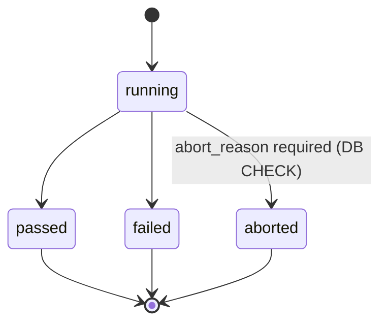
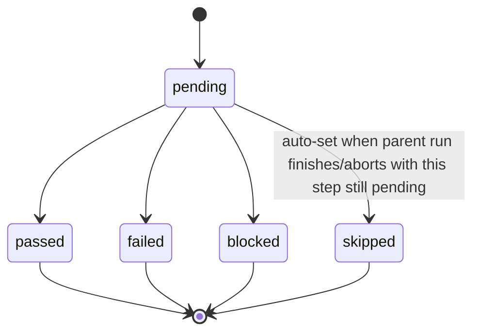
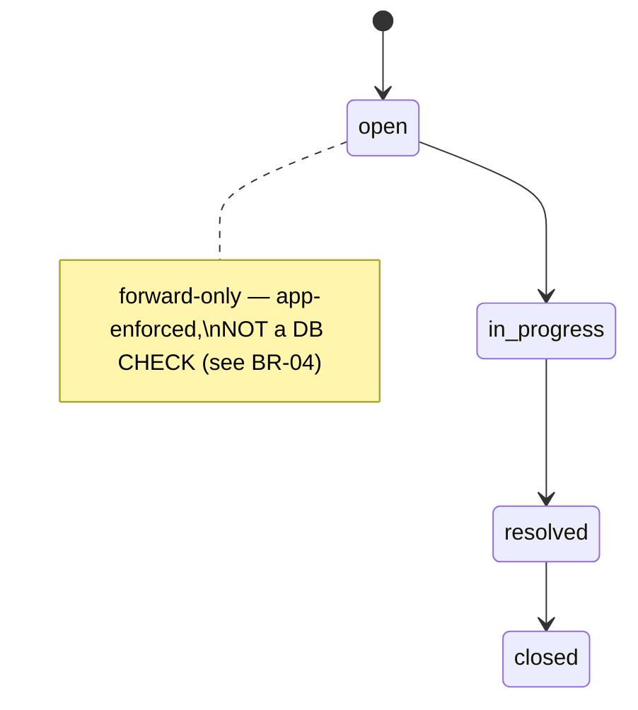
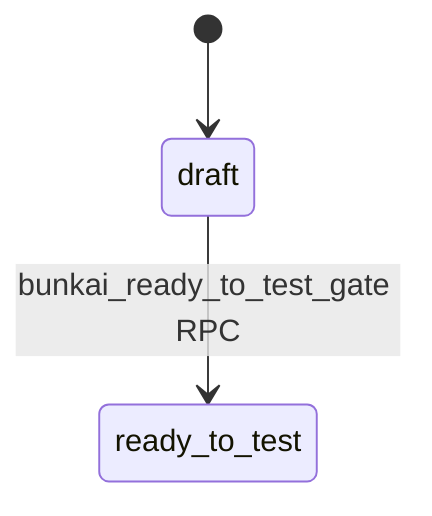

# SRS — Functional Specifications: Bunkai TMS

> Generated by: `/project-discovery` Phase 2, sub-step 4 (SRS — Functional Specs)
> Generated: 2026-08-15
> Target repo assessed: `upex-bunkai-tms` at `staging` HEAD (`de670c4`)
> Sources: direct code reads (`app/api/v1/**/route.ts`, `lib/<domain>/{validation,errors}.ts`), live `staging` schema via `staging-dbhub` MCP, cross-referenced against `bunkai-qa-engineering/.context/business/domain-glossary.md` (BR-01 through BR-06) and `.context/PRD/user-journeys.md`.
> **FR scope**: top-5 critical flows, selected for structural load-bearing weight (BR-anchored) + P0 test-scenario priority per `user-journeys.md` §11. Test Assembly (Tests CRUD) and Traceability (read-only report) are documented flows but not FR-numbered here — see `business-api-map.md` Journey 4/7 for those; this document's cap follows the same "top-5/7" scoping convention already established in the pre-existing business docs.

---

## Specification Index

| ID | Feature | Category | Priority |
|---|---|---|---|
| FR-001 | ATC Creation with Anchoring Invariant | ATC Authoring | P0 |
| FR-002 | Manual Run Execution (start → mark steps → finish) | Test Execution | P0 |
| FR-003 | Run Abort with Mandatory Reason | Test Execution | P0 |
| FR-004 | Run-Linked Bug Filing | Defect Management | P0 |
| FR-005 | Headless Sign-up with Mandatory OTP Confirmation (BK-166) | Authentication | P0 |

---

## FR-001: ATC Creation with Anchoring Invariant

### Overview

| Field | Value |
|---|---|
| Feature | ATC (Acceptance Test Case) authoring |
| Related PRD section | `executive-summary.md` §2 Core Capability #1; `user-journeys.md` Journey 2 |
| Service/method | `POST /api/v1/atcs` → `lib/supabase/rpc.ts createAtc()` → `bunkai_create_atc` RPC |
| Evidence path | `app/api/v1/atcs/route.ts`, `lib/atcs/validation.ts`, `lib/atcs/errors.ts` |

### Functional Requirement

The system SHALL reject the creation of an ATC unless it is anchored to exactly one User Story and at least one Acceptance Criterion that genuinely belongs to that User Story, and the write SHALL be atomic across all 4 child tables (`atcs`, `atc_steps`, `atc_assertions`, `atc_acceptance_criteria`).

### Input Specification

| Field | Type | Required | Notes |
|---|---|---|---|
| `module_id` | UUID | Yes | Must be the User Story's own module or a descendant in the same project |
| `user_story_id` | UUID | Yes | The anchoring Story |
| `title` | string | Yes | 3-200 chars |
| `layer` | enum | Yes | `UI` \| `API` \| `Unit` |
| `tags` | string[] | No | Max 10 |
| `steps` | array | Yes | Min 1 item — see Validation Rules |
| `assertions` | array | No | Default `[]` |
| `acceptance_criterion_ids` | UUID[] | Yes | Min 1 — every id must belong to `user_story_id` |

### Validation Rules (code evidence)

```ts
// lib/atcs/validation.ts
export const AtcWriteBodySchema = z.object({
  title: z.string().min(3).max(200),
  layer: z.enum(['UI', 'API', 'Unit']),
  tags: z.array(z.string()).max(10).optional().default([]),
  steps: z.array(AtcStepInputSchema).min(1),
  assertions: z.array(AtcAssertionInputSchema).optional().default([]),
  acceptance_criterion_ids: z.array(z.string().uuid()).min(1),
});
// Per-field content budget: MAX_ATC_CONTENT_BYTES = 2048 (UTF-8 bytes, measured
// via a custom byteLength() — NOT Zod .max(), which counts UTF-16 units).
// Step positions: integers, strictly increasing from 1 (stepPositionsError()) —
// gaps allowed (e.g. [1,2,5]), persisted as-is.
```

### Processing Logic

1. `withApiHandler` resolves the `Principal` (cookie or Bearer) and enforces `requires: ['atc:write']` **before** the handler body runs — `app/api/v1/atcs/route.ts:16`.
2. Request body parsed against `AtcCreateBodySchema` (extends `AtcWriteBodySchema` with `module_id`/`user_story_id`) — 422 `validation_failed` on shape violation — `route.ts:20`.
3. `stepPositionsError()` checks integers-strictly-increasing-from-1; a violation raises `steps_position_invalid` (422) with the offending positions listed — `route.ts:23-28`.
4. `createAtc()` calls the `bunkai_create_atc` SECURITY DEFINER RPC, passing every field plus `actorUserId` — `route.ts:33-42`.
5. Inside the RPC (Postgres, not re-derived from source here — see `domain-glossary.md` BR-01 for the Given/When/Then): validates every `ac_id` belongs to `user_story_id` (raises SQLSTATE `45020` on violation) and that `module_id` is the Story's own module or a descendant (raises `45021`), **before** the atomic 4-table write commits.
6. On RPC error, `mapAtcRpcError()` translates the Postgres SQLSTATE to the canonical envelope — `route.ts:43-45`.
7. Success: `201 { atc: <created row> }` — `route.ts:47`.

### Output Specification

| Outcome | Status | Body |
|---|---|---|
| Success | 201 | `{ atc: {...} }` |
| Missing/expired auth | 401 | `{ error: { code: 'unauthorized', ... } }` |
| Missing `atc:write` capability | 403 | `{ error: { code: 'forbidden', ... } }` |
| Malformed body | 422 | `{ error: { code: 'validation_failed', details: [zod issues] } }` |
| Step positions non-sequential | 422 | `{ error: { code: 'steps_position_invalid', details: { positions: [...] } } }` |
| AC not in the given User Story (BR-01 violation) | **422** | `{ error: { code: 'ac_outside_user_story', message: 'Every acceptance criterion must belong to the given user story.' } }` — SQLSTATE `45020` |
| Module outside the Story's project subtree | 422 | `{ error: { code: 'module_outside_project_subtree', ... } }` — SQLSTATE `45021` |
| Not a workspace member with write access | 403 | `{ error: { code: 'forbidden', details: { reason: 'not_a_member' } } }` — SQLSTATE `42501` |
| Referenced entity not found | 404 | `{ error: { code: 'not_found', details: { reason: 'not_found' } } }` — SQLSTATE `P0002` |
| Slug collision (astronomically rare) | 409 | `{ error: { code: 'slug_collision', ... } }` — SQLSTATE `23505` |

> **Closes a prior Discovery Gap**: `domain-glossary.md` §8 flagged "ATC-anchoring rejection error message/shape not directly observed" — this pass reads `lib/atcs/errors.ts` directly and confirms the exact code: **`ac_outside_user_story`, HTTP 422, SQLSTATE `45020`**.

### Business Rules

| ID | Rule | Enforcement |
|---|---|---|
| BR-01 | An ATC cannot exist without ≥1 User Story anchor and ≥1 Acceptance Criterion belonging to that Story | RPC pre-check (SQLSTATE `45020`) + `atcs.user_story_id NOT NULL` + FK RESTRICT + `atc_acceptance_criteria` composite FK |
| BR-01a (new, this pass) | Module must be the Story's own module or a descendant in the same project | RPC pre-check (SQLSTATE `45021`) |
| BR-01b (new, this pass) | An ATC has at most 10 tags | Zod `.max(10)` at the route; RPC-layer backstop SQLSTATE `45024` for callers that skip the route (e.g. direct PostgREST) |

### Edge Cases

| Case | Expected Behavior | Evidence |
|---|---|---|
| `acceptance_criterion_ids: []` (empty array) | Rejected at 422 by Zod `.min(1)` before any DB round-trip | `lib/atcs/validation.ts:41` |
| `steps: []` (empty array) | Rejected at 422 by Zod `.min(1)` | `lib/atcs/validation.ts:39` |
| Step content exceeds 2048 UTF-8 bytes (multibyte input, e.g. emoji/CJK) | Rejected — byte-measured, not UTF-16-code-unit-measured, so a string that passes a naive `.length` check can still fail here | `lib/atcs/validation.ts:19,24` |
| Step positions `[1, 3]` (gap) | **Accepted** — gaps are allowed, only strictly-increasing-from-1 is enforced | `lib/atcs/validation.ts:81-92` |
| Step positions `[1, 1]` (duplicate) | Rejected — `steps_position_invalid` | `stepPositionsError()` |
| 11th tag | Rejected at the route (Zod) before reaching the RPC; RPC also backstops it (SQLSTATE `45024`) for a caller bypassing the route entirely | `lib/atcs/errors.ts:43-50` |
| Two concurrent creates racing on the same computed slug | One succeeds, the other gets `slug_collision` (409) — the response message explicitly invites a retry | `lib/atcs/errors.ts:39-42` |

---

## FR-002: Manual Run Execution (start → mark steps → finish)

### Overview

| Field | Value |
|---|---|
| Feature | Manual Run Execution — turns Bunkai into a closed-loop TMS |
| Related PRD section | `executive-summary.md` §2 Core Capability #3; `user-journeys.md` Journey 3 |
| Service/method | `POST /api/v1/runs`, `.../steps/{stepId}/mark`, `.../finish` |
| Evidence path | `app/api/v1/runs/route.ts`, `app/api/v1/runs/[id]/steps/[stepId]/mark/route.ts`, `app/api/v1/runs/[id]/finish/route.ts`, `lib/runs/validation.ts`, `lib/api/idempotency.ts` |

### Functional Requirement

The system SHALL start a Run only with a caller-supplied `Idempotency-Key` header (hard-required, not optional), SHALL snapshot the Test's ATC chain at start time so later edits/deletes never corrupt Run history, SHALL allow each step to be marked pass/fail/blocked idempotently (last-write-wins, not first-wins), and SHALL auto-transition any still-`pending` step to `skipped` when the Run finishes.

### Input Specification — start

| Field | Type | Required | Notes |
|---|---|---|---|
| `test_id` | UUID | Yes | |
| `environment_id` | UUID | Yes | Must belong to the Test's own Project |
| `executor_mode` | enum | No | `human` \| `agent` \| `ci` — cookie sessions are forced to `human`; a Bearer caller may declare `agent`/`ci`, defaults to `human` |
| `start_token` | string | No | Domain-level idempotency token, 1-N chars; if omitted, a fresh UUID is minted (each start becomes a NEW Run) |
| Header `Idempotency-Key` | string | **Yes (HTTP-level, hard-required)** | 8-128 chars, pattern `^[\w-]{8,128}$` |

### Input Specification — mark step

| Field | Type | Required | Notes |
|---|---|---|---|
| `status` | enum | Yes | `passed` \| `failed` \| `blocked` \| `skipped` (per `RUN_STEP_STATUSES`) |
| `note` | string | No | Trimmed, max length enforced |
| `evidence_url` | string (URL) | No | http/https-only allowlist (`z.regexes.httpProtocol`) — same BK-337 protocol tightening as Bug evidence URLs |

### Input Specification — finish

| Field | Type | Required | Notes |
|---|---|---|---|
| `verdict` | enum | Yes | `RUN_FINISH_VERDICTS` — AC-frozen "verdict required" message on omission |

### Validation Rules (code evidence)

```ts
// lib/runs/validation.ts
export const RunCreateBodySchema = z.object({
  test_id: z.string().uuid(),
  environment_id: z.string().uuid(),
  executor_mode: z.enum(RUN_EXECUTOR_MODES).optional(),
  start_token: z.string().trim().min(1).max(RUN_START_TOKEN_MAX).optional(),
});
export const RunStepMarkBodySchema = z.object({
  status: z.enum(RUN_STEP_STATUSES),
  note: z.preprocess(..., z.string().trim().max(RUN_STEP_NOTE_MAX).nullable().optional()),
  evidence_url: z.preprocess(..., z.string().trim().max(RUN_STEP_EVIDENCE_URL_MAX)
    .url({ protocol: z.regexes.httpProtocol }).nullable().optional()),
});
// HTTP-level replay guard (lib/api/idempotency.ts):
const KEY_PATTERN = /^[\w-]{8,128}$/;
```

### Processing Logic — start (`POST /api/v1/runs`)

1. `Principal` resolved, `run:execute` capability enforced — `route.ts` (`withApiHandler`).
2. Body parsed against `RunCreateBodySchema`.
3. `executorMode` derived: cookie ⇒ always `human`; bearer ⇒ `body.executor_mode ?? 'human'`.
4. `startToken` derived: `body.start_token ?? randomUUID()` — the domain-level dedup key.
5. Workspace resolved for the **Idempotency-Key namespace** via `resolveRunWorkspaceId()` — a distinct concept from the domain `start_token` window (BK-182 regression note in-code: "throwing there would revert the BK-182 fix").
6. `beginIdempotentRequest()` checks the HTTP-level `Idempotency-Key` — if this exact key was already processed for this user+endpoint, replay the stored snapshot verbatim (`begin.isReplay`).
7. `createRun()` calls `bunkai_create_run` RPC — write-membership gate, executor-mode/environment/executable-steps validation, the 24h same-`start_token` dedup window (domain-level, separate from the HTTP key), the chain-snapshot walk into `run_atcs`/`run_steps`, `run.started` audit.
8. RPC tags the response `replayed: true/false` — `200` if the 24h `start_token` window returned an existing Run, `201` if freshly created.
9. Any throw before the RPC commits discards the pending idempotency key (`discardIdempotencyResult`) so it does not strand; a snapshot-store failure AFTER a successful RPC does NOT fail the request (logged only) — the row is left to expire by its own TTL.

### Processing Logic — mark step

1. Auth + capability check, ids extracted and UUID-validated.
2. Body parsed (`RunStepMarkBodySchema`, plain `.parse()` — no AC-frozen copy override needed here, unlike abort/finish).
3. `markRunStep()` RPC: member+ write gate, `status='running'` guard on the parent Run, status-value backstop, empty-string→`null` normalization, **UPDATE-in-place** (deliberate last-write-wins — re-marking the same step is NOT a conflict, unlike abort/finish's first-wins close), recomputes the parent `run_atcs` verdict.

### Processing Logic — finish

1. Auth + capability check, run id extracted and validated.
2. Body parsed with `safeParse` + an AC-exact "verdict required" message override (not the generic ZodError envelope) when `verdict` is missing/invalid.
3. `finishRun()` RPC: member+ write gate, `status='running'` guard, atomic close, **auto-skip any still-`pending` step**, `run.finished` audit → fires `activity_log_notify_run_event` trigger → Notification row.
4. **First-wins close semantics**: unlike `mark`, a double-submit of `finish` (or a race with `abort`) re-reads a terminal status and returns `409 conflict` ("This run is already closed and cannot be finished.") — no `Idempotency-Key` header needed because the RPC's row lock makes it first-wins by construction.

### Output Specification

| Outcome | Status | Body |
|---|---|---|
| Run started (fresh) | 201 | `{ run: {...} }` |
| Run started (24h `start_token` replay) | 200 | `{ run: {...same as original...} }` |
| Missing `Idempotency-Key` header | 400 | `{ error: { code: 'idempotency_key_required' } }` |
| Malformed `Idempotency-Key` | 400 | `{ error: { code: 'idempotency_key_invalid' } }` |
| No executable steps on the Test | 422 | `{ error: { code: 'no_executable_steps' } }` |
| Environment not in the Test's Project | 422 | `{ error: { code: 'environment_invalid' } }` |
| Step marked successfully | 200 | `{ run: {...updated...} }` |
| Run finished successfully | 200 | `{ run: {...terminal...} }` |
| Finish/mark on a non-`running` Run | 409 | `{ error: { code: 'conflict', message: 'This run is already closed and cannot be finished.' } }` |
| Finish with no verdict | 422 | `{ error: { code: 'validation_failed', details: { reason: 'finish_verdict_invalid' } } }` — AC-frozen `RUN_FINISH_VERDICT_REQUIRED_MESSAGE` |

### Business Rules

| ID | Rule | Enforcement |
|---|---|---|
| BR-06 | `Idempotency-Key` header is hard-required on `POST /runs`; the same key within its TTL window returns the original response, not a new Run | `lib/api/idempotency.ts`, `idempotency_keys` table |
| BR-06a (new) | The domain `start_token` 24h dedup window is a SEPARATE mechanism from the HTTP `Idempotency-Key` — both must be tested independently, not conflated | in-code comment, `route.ts` |
| BR-New-1 | Finishing a Run auto-transitions any still-`pending` step to `skipped` | `bunkai_finish_run` RPC behavior (app-layer trigger-adjacent behavior, verify behaviorally per domain-glossary §3 caveat) |

### Edge Cases

| Case | Expected Behavior | Evidence |
|---|---|---|
| Two concurrent `POST /runs` with the identical `Idempotency-Key` | Second request replays the first's stored snapshot verbatim, never creates a second Run | `lib/api/idempotency.ts` |
| `POST /runs` with the identical `start_token` but a DIFFERENT `Idempotency-Key`, within 24h | Domain-level dedup still returns the original Run (`replayed: true`, 200) — the HTTP key and domain token are independent dedup surfaces that happen to agree here | route.ts comment + BR-06a |
| Re-marking an already-marked step to a different status | **Allowed** — UPDATE-in-place, last-write-wins, not a 409 | `mark/route.ts` comment |
| `finish` called twice in a row | Second call gets `409 conflict` — first-wins | `finish/route.ts` comment |
| `abort` racing `finish` on the same Run | Whichever RPC call wins the row lock closes the Run; the loser gets `409 conflict` | `abort/route.ts` + `finish/route.ts` comments |
| Bearer (agent/CI) caller omits `executor_mode` | Defaults to `human`, NOT `agent`/`ci` — a test asserting "an unattended CI run shows as CI" must explicitly pass `executor_mode: 'ci'` | route.ts: `body.executor_mode ?? 'human'` |

---

## FR-003: Run Abort with Mandatory Reason

### Overview

| Field | Value |
|---|---|
| Feature | Run Abort |
| Related PRD section | `user-journeys.md` Journey 3 (Error Paths) |
| Service/method | `POST /api/v1/runs/{id}/abort` → `bunkai_abort_run` RPC |
| Evidence path | `app/api/v1/runs/[id]/abort/route.ts`, `lib/runs/validation.ts` |

### Functional Requirement

The system SHALL reject an abort request whose `reason` is missing, empty, or outside 3-500 characters, and SHALL enforce this at the database layer (a CHECK constraint) independently of the API-layer validation, so a crafted request bypassing the API cannot leave an abort without a reason.

### Input Specification

| Field | Type | Required | Notes |
|---|---|---|---|
| `reason` | string | Yes | Trimmed, 3-500 chars (`RUN_ABORT_REASON_MIN = 3`, `RUN_ABORT_REASON_MAX = 500`) |

### Validation Rules (code evidence)

```ts
// lib/runs/validation.ts
export const RUN_ABORT_REASON_MIN = 3;
export const RUN_ABORT_REASON_MAX = 500;
export const RunAbortBodySchema = z.object({
  reason: z.string().trim().min(RUN_ABORT_REASON_MIN).max(RUN_ABORT_REASON_MAX),
});
```

### Processing Logic

1. Run id extracted from the path and UUID-validated.
2. Auth + `run:execute` capability enforced.
3. Body parsed with `safeParse` (not `.parse()`) so an AC-exact copy can be substituted for the generic ZodError envelope: `RUN_ABORT_REASON_TOO_SHORT_MESSAGE` / `RUN_ABORT_REASON_TOO_LONG_MESSAGE`, distinguished by inspecting `issue.code === 'too_big'`.
4. `abortRun()` RPC: member+ write gate, `status='running'` guard, the reason backstop (**this is where BR-02's DB CHECK constraint actually lives** — `runs_abort_reason_chk`), atomic close + skip-pending-steps walk + `run.aborted` audit.
5. `via: principal.via` is passed through so the run-event notification trigger's self-suppression predicate can distinguish a PAT-impersonated actor from a genuine session (BK-211/12196/12198).

### Output Specification

| Outcome | Status | Body |
|---|---|---|
| Aborted successfully | 200 | `{ run: {...status:'aborted'...} }` |
| Reason too short (< 3 chars) | 422 | `{ error: { code: 'validation_failed', message: 'Please give a reason of at least 3 characters', details: { reason: 'abort_reason_too_short', max: 500 } } }` |
| Reason too long (> 500 chars) | 422 | `{ error: { code: 'validation_failed', message: 'The reason must be at most 500 characters', details: { reason: 'abort_reason_too_long', max: 500 } } }` |
| Already closed | 409 | `{ error: { code: 'conflict', message: 'This run is already closed and cannot be aborted.' } }` |
| Non-UUID run id | 400 | `{ error: { code: 'bad_request', message: 'Run id must be a UUID.' } }` |

### Business Rules

| ID | Rule | Enforcement |
|---|---|---|
| BR-02 | A Run cannot be aborted without a 3-500 char reason | **Both** the API-layer Zod schema AND the DB-layer `runs_abort_reason_chk` CHECK constraint (`abort_reason` required iff `status='aborted'`, else must be NULL) — genuinely independent enforcement, worth a dedicated negative test at each layer |

### Edge Cases

| Case | Expected Behavior | Evidence |
|---|---|---|
| `reason: "   "` (whitespace-only, 3+ raw chars) | Rejected — `.trim()` runs BEFORE `.min(3)`, so whitespace does not satisfy the length floor | `z.string().trim().min(3)` |
| `reason` exactly 3 chars after trim | Accepted (boundary) | `.min(3)` inclusive |
| `reason` exactly 500 chars after trim | Accepted (boundary) | `.max(500)` inclusive |
| `reason` 501 chars | Rejected — `abort_reason_too_long` | boundary |
| A crafted request that bypasses the Zod layer entirely (e.g. direct PostgREST/RPC call with no `reason`) | Still rejected — `runs_abort_reason_chk` CHECK constraint fires at the DB layer, independent of anything in this TypeScript file | `domain-glossary.md` BR-02 |
| Abort attempted on a Run already `finished`/`aborted` | 409 conflict, same as a double-finish | `abort/route.ts` comment |

---

## FR-004: Run-Linked Bug Filing

### Overview

| Field | Value |
|---|---|
| Feature | Native Bug filing, anchored to Module + ATC + Run |
| Related PRD section | `executive-summary.md` §2 Core Capability #4; `user-journeys.md` Journey 3, step 6 |
| Service/method | `POST /api/v1/bugs` (run-linked variant) → `bunkai_create_bug` RPC |
| Evidence path | `app/api/v1/bugs/route.ts`, `lib/bugs/validation.ts`, `lib/bugs/errors.ts` |

### Functional Requirement

The system SHALL allow filing a Bug from a failed Run step by accepting ONLY `run_step_id` from the client (never `project_id`/`module_id`/`run_id`/`atc_id`, which are always server-derived from a membership-gated read of the owning Run), SHALL reject filing against a step that is not `status='failed'`, and SHALL validate at the DB-trigger layer that all derived cross-entity references genuinely belong together.

### Input Specification (run-linked variant)

| Field | Type | Required | Notes |
|---|---|---|---|
| `run_step_id` | UUID | Yes | The failed step being reported against |
| `title` | string | Yes | Trimmed, `BUG_TITLE_MIN`-`BUG_TITLE_MAX` chars (5-200 per domain-glossary CHECK) |
| `severity` | enum | Yes | `P1` \| `P2` \| `P3` \| `P4` |
| `description` | string | No | |
| `steps_to_reproduce` | string | No | |
| `evidence_urls` | string[] (URL) | No | Max `BUG_EVIDENCE_MAX` (10 per domain-glossary), http/https-only |

> `project_id`/`module_id`/`run_id`/`atc_id` are **never accepted from the client** on this path (Technical Decision 7, in-code comment) — even if a client sends them, `z.object`'s default strip-unknown-keys behavior silently drops them once the run-linked branch matches.

### Validation Rules (code evidence)

```ts
// lib/bugs/validation.ts
const titleSchema = z.string().trim().min(BUG_TITLE_MIN).max(BUG_TITLE_MAX);
const severitySchema = z.enum(BUG_SEVERITY_VALUES);
// BK-337 (TQ5) — tightened from a bare z.string().url() (accepted ANY scheme,
// including javascript:/data:) to an explicit http/https-only allowlist:
const evidenceUrlsSchema = z.array(z.url({ protocol: z.regexes.httpProtocol })).max(BUG_EVIDENCE_MAX).optional();
export const BugRunLinkedCreateBodySchema = z.object({
  run_step_id: z.string().uuid(),
  title: titleSchema, severity: severitySchema,
  description: z.string().trim().optional(),
  steps_to_reproduce: z.string().optional(),
  evidence_urls: evidenceUrlsSchema,
});
```

### Processing Logic

1. Auth + `atc:write` capability enforced (Bug filing reuses this existing capability rather than inventing a `bug:*` scope — Technical Decision 13, in-code comment).
2. Body parsed; `isRunLinkedBugBody()` discriminates the run-linked vs. standalone shape (a plain `z.union`, not `discriminatedUnion`, because the two branches have disjoint required-key sets rather than a shared literal tag).
3. For the run-linked branch: `getRunExpanded()` reads the owning Run through the SAME membership-gated RPC the Runner UI already uses (`bunkai_get_run_expanded`) — this is what actually proves "the caller can read this run," not the mere existence of `run_step_id`.
4. `locateRunStepBugContext()` (pure, unit-testable) walks the trusted Run payload to find the specific step, returning `{ runId, projectId, moduleId, atcId, stepStatus }`.
5. `assertRunLinkedStepIsFailed(stepStatus)` (pure, separately unit-tested per a 2026-08-01 review finding that prior coverage only proved the STATUS was read correctly, never that the enforcement decision itself was exercised) — throws `validation_failed` / `run_step_not_failed` if `stepStatus !== 'failed'`.
6. `createBug()` calls `bunkai_create_bug` RPC with the server-derived `project_id`/`module_id`/`atc_id`. The RPC **independently re-validates module ∈ project** (defense in depth) regardless of this handler's own derivation.
7. Inside the RPC: the `bugs_check_consistency` BEFORE INSERT trigger validates that `run_step_id`/`atc_id`/`run_id`/`project_id` genuinely belong to the same execution chain — a crafted payload referencing mismatched entities is rejected at the DB layer even if steps 3-5 above were somehow bypassed.
8. On success, the `bugs_set_updated_at` trigger and `activity_log_notify_bug_event` trigger fire (Notification row).

### Output Specification

| Outcome | Status | Body |
|---|---|---|
| Filed successfully | 201 | `{ bug: {...} }` (inferred status code — standard REST create convention; not independently re-verified this pass, Discovery Gap) |
| Step not `failed` | 422 | `{ error: { code: 'validation_failed', message: 'Bug filing is only available for a failed run step.', details: { reason: 'run_step_not_failed' } } }` |
| Not a workspace member with write access | 403 | `{ error: { code: 'forbidden', details: { reason: 'not_a_member' } } }` — SQLSTATE `42501` |
| Project/module not found (create/list) | 404 | `{ error: { code: 'not_found', message: 'Project or module not found.', details: { reason: 'not_found' } } }` — SQLSTATE `P0002`, non-disclosure default |
| Mismatched run/atc/project references | Rejected by `bugs_check_consistency` trigger — exact HTTP mapping for THIS specific trigger failure (as opposed to the RPC's own `P0002`) not independently re-observed this pass | Discovery Gap — read `0046_bugs.sql` directly before asserting a literal error code |

### Business Rules

| ID | Rule | Enforcement |
|---|---|---|
| BR-03 | A Bug's `run_step_id`/`atc_id`/`run_id`/`project_id` must all genuinely belong to the same execution chain | `bugs_check_consistency` BEFORE INSERT/UPDATE trigger — confirmed NOT a CHECK constraint, a genuine trigger |
| BR-New-2 | A Bug can only be filed against a run step whose status is `failed` | App-layer only (`assertRunLinkedStepIsFailed`) — **not confirmed as a DB-layer backstop this pass**, flagged below |

### Edge Cases

| Case | Expected Behavior | Evidence |
|---|---|---|
| `run_step_id` from Run X, but the caller is not a member of Run X's workspace | `getRunExpanded()`'s own membership gate rejects before `locateRunStepBugContext` ever runs — the caller never even learns whether the step exists | `route.ts` comment |
| `run_step_id` pointing at a `passed`/`blocked`/`pending`/`skipped` step | Rejected — `run_step_not_failed` | `assertRunLinkedStepIsFailed()` |
| Client sends `project_id`/`module_id` alongside `run_step_id` (attempting to override server derivation) | Silently stripped by Zod's default unknown-key behavior once the run-linked branch matches — the client-sent values are NEVER used | `lib/bugs/validation.ts` header comment |
| `evidence_urls` containing a `javascript:`/`data:` scheme | Rejected at filing time (BK-337 fix) — same protocol allowlist as Run-step evidence URLs | `evidenceUrlsSchema` |
| **DB-layer backstop for BR-New-2 not confirmed** — whether a direct RPC/PostgREST call bypassing `assertRunLinkedStepIsFailed` would also be rejected at the DB layer was not independently verified this pass (unlike BR-02's abort-reason CHECK, which IS DB-enforced) | Flagged as a genuine open question, not assumed either way | Discovery Gap |

---

## FR-005: Headless Sign-up with Mandatory OTP Confirmation (BK-166)

### Overview

| Field | Value |
|---|---|
| Feature | Password sign-up + mandatory 6-digit OTP confirmation (machine + human headless path) |
| Related PRD section | `user-journeys.md` Journey 1 (steps 2a-3), Journey 5 |
| Service/method | `POST /api/v1/auth/signup`, `POST /api/v1/auth/confirm` |
| Evidence path | `app/api/v1/auth/signup/route.ts`, `app/api/v1/auth/confirm/route.ts` |

### Functional Requirement

The system SHALL NOT issue a session or a PAT at sign-up time — only after the caller separately confirms a 6-to-8-digit OTP via `POST /api/v1/auth/confirm`, with no bypass path, closing the prior "admin-create auto-confirm" backdoor.

### Input Specification — confirm

| Field | Type | Required | Notes |
|---|---|---|---|
| `email` | string (email) | Yes | Max 254 chars |
| `token` | string | Yes | Regex `^\d{6,8}$` — Supabase emits 6-to-8 digit codes |
| `pat_name` | string | No | 1-80 chars |
| `pat_scopes` | enum[] | No | Any of the 4 scopes; defaults to `DEFAULT_PAT_SCOPES` (excludes `workspace:admin`) |
| `pat_expires_in_days` | integer | No | 1-365 |

### Validation Rules (code evidence)

```ts
// app/api/v1/auth/confirm/route.ts
const BodySchema = z.object({
  email: z.string().email().max(254),
  token: z.string().regex(/^\d{6,8}$/, 'Verification code must be 6 to 8 digits.'),
  pat_name: z.string().min(1).max(80).optional(),
  pat_scopes: z.array(z.enum(['atc:read', 'atc:write', 'run:execute', 'workspace:admin'])).optional(),
  pat_expires_in_days: z.number().int().positive().max(365).optional(),
});
```

### Processing Logic

1. `POST /api/v1/auth/signup` — `auth: 'public'`. Calls `admin.createUser()` with **NO** auto-confirm. Issues **no session, no PAT** — comment explicitly: "closes the auto-confirm backdoor the old admin-create flow opened."
2. Client separately calls `POST /api/v1/auth/confirm { email, token }`.
3. `supabase.auth.verifyOtp({ email, token, type: 'signup' })` — on the SSR client, this establishes session cookies as a side effect.
4. `error?.status === 429` ⇒ `rate_limited` (Supabase's own rate limiter, passthrough).
5. Any other error, or a missing `user`/`session` ⇒ **uniform 401** `'Invalid or expired verification code.'` — never distinguishes "no such pending signup" from "wrong code" (non-disclosure pattern, same family as the Bearer-auth uniform-401).
6. `scopes = pat_scopes ?? DEFAULT_PAT_SCOPES`; `assertNoGlobalAdminScope(scopes)` — hard-rejects any attempt to request `workspace:admin` via this headless path.
7. `mintPat()` mints a PAT in the same call.
8. Response returns `{ user, session, pat, warning: 'Store the PAT token now — it cannot be retrieved later.' }` — byte-for-byte the same shape as `POST /auth/signin`'s success response, so a CLI/agent gets both credentials in one round trip regardless of which path it took.

### Output Specification

| Outcome | Status | Body |
|---|---|---|
| Confirmed successfully | 200 | `{ user: {id, email}, session: {access_token, refresh_token, expires_at, token_type}, pat: {token, id, name, scopes, expires_at}, warning: '...' }` |
| Wrong/expired code, or no pending signup | 401 | `{ error: { code: 'unauthorized', message: 'Invalid or expired verification code.' } }` — uniform, non-disclosing |
| Rate-limited by Supabase | 429 | `{ error: { code: 'rate_limited', ... } }` |
| Malformed body (bad email/token shape) | 422 | generic `validation_failed` envelope |
| `pat_scopes` includes `workspace:admin` | Silently rejected by `assertNoGlobalAdminScope` — throws `forbidden`, NOT a silent downgrade | `lib/api/pat.ts:33-40` |

### Business Rules

| ID | Rule | Enforcement |
|---|---|---|
| BR-New-3 | Sign-up issues no credentials; only `confirm` does | `signup/route.ts` — no `mintPat`/session call present |
| BR-New-4 | A headless-issued PAT can never carry `workspace:admin` scope, even if explicitly requested in the body | `assertNoGlobalAdminScope()` — same guard as `signin`, ADR-0005 |
| Related — BR from `domain-glossary` | Every headless mint point uses `DEFAULT_PAT_SCOPES` (excludes `workspace:admin`) by default | `business-api-map.md` §2 |

### Edge Cases

| Case | Expected Behavior | Evidence |
|---|---|---|
| `token: "12345"` (5 digits) | Rejected at 422 by the regex before any Supabase call | `/^\d{6,8}$/` |
| `token: "123456789"` (9 digits) | Rejected at 422 | same regex |
| Correct code, but submitted after Supabase's own OTP expiry window | Uniform 401 — same message as a wrong code, no distinct "expired" signal | `verifyOtp` error path |
| Sign-in attempted before OTP confirmed | Distinct error, but on the SIGN-IN route, not this one: `'Verify your email with the code we sent before signing in.'` — cross-referenced from `user-personas.md` Pain Points, not re-derived here | `email-first-form.tsx:119` |
| Requesting `pat_scopes: ['workspace:admin']` at confirm time | `forbidden` — the scope is accepted as an input shape but always rejected at runtime | `confirm/route.ts` comment: "accepted as an input value but rejected at runtime" |

---

## State Machines

> Promoted from `bunkai-qa-engineering/.context/business/domain-glossary.md` §6, which has the Mermaid diagrams but not transition tables. This section adds the From/To/Trigger/Guard/Side-Effects tables the doctrine requires; diagrams are reused verbatim (same live-schema source, no drift found).

### `runs.status` (run-grain — whole-execution outcome)



| From | To | Trigger | Guard | Side Effects |
|---|---|---|---|---|
| — | `running` | `POST /api/v1/runs` | `Idempotency-Key` header present + valid; ≥1 executable step on the Test; environment belongs to the Test's Project | Snapshots ATC chain into `run_atcs`/`run_steps` (all `pending`); `run.started` audit |
| `running` | `passed` / `failed` | `POST /runs/{id}/finish` | Row lock (first-wins); `verdict` present in body | Any still-`pending` step auto-`skipped`; `run.finished` audit → `activity_log_notify_run_event` trigger → Notification |
| `running` | `aborted` | `POST /runs/{id}/abort` | Row lock (first-wins); `abort_reason` 3-500 chars — **DB CHECK `runs_abort_reason_chk`, independent of API validation** | Atomic close + skip-pending-steps walk; `run.aborted` audit |
| `passed`/`failed`/`aborted` | (none) | any further `finish`/`abort`/`mark` call | — | `409 conflict` — terminal states reject further mutation |

**Note**: `aborted` is a run-grain-only terminal state — it never appears at the `run_atcs`/`run_steps` grain (a step is `skipped`, never `aborted`).

### `run_atcs.status` / `run_steps.status` (position grain)



| From | To | Trigger | Guard | Side Effects |
|---|---|---|---|---|
| — | `pending` | Parent Run starts | (none — every snapshotted step starts `pending`) | Denormalized `atc_title` snapshot, survives later ATC edit/archive |
| `pending` | `passed`/`failed`/`blocked` | `POST /runs/{id}/steps/{stepId}/mark` | Parent Run `status='running'` | **UPDATE-in-place, last-write-wins** — re-marking is NOT a conflict (unlike the run-grain finish/abort, which is first-wins); parent `run_atcs` verdict recomputed |
| `pending` | `skipped` | Parent Run `finish` or `abort` | Step still `pending` when the parent closes | Automatic, no direct client trigger |
| `passed`/`failed`/`blocked`/`skipped` | `pending` | **None found** | — | No un-mark / reopen path exists — confirm this is by design, not an oversight, before assuming a "reopen step" test scenario is valid |

**UI label note** (carried from `domain-glossary.md` §7, not re-verified): `pending` renders as **"Unrun"** in the verdict badge — stored literal and UI word differ.

### `bugs.status`



| From | To | Trigger | Guard | Side Effects |
|---|---|---|---|---|
| — | `open` | `POST /api/v1/bugs` | `bugs_check_consistency` trigger passes | `bugs_set_updated_at` trigger; `activity_log_notify_bug_event` → Notification |
| `open` | `in_progress` | `POST /bugs/{id}/status` ("Start progress" action) | `bunkai_transition_bug_status` RPC — target status must be exactly one stage ahead (SQLSTATE `45310` otherwise, with the actual required next stage named in the error message) | — |
| `in_progress` | `resolved` | ("Mark resolved" action) | Same one-stage-ahead rule | — |
| `resolved` | `closed` | ("Close" action) | Same one-stage-ahead rule | — |
| any | any backward (e.g. `closed` → `open`) | Crafted/direct request | **App-enforced only** — `bugs_status_check` CHECK constrains the value SET, not the transition ORDER; no DB-layer ordering guard exists | **BR-04 residual risk** — a genuine gap worth a dedicated negative test per `domain-glossary.md` |
| any | 2+ stages ahead (e.g. `open` → `resolved`) | `POST /bugs/{id}/status` | Rejected — SQLSTATE `45310`, message names the actual next required stage (derived client-side from `BUG_STATUS_VALUES` array order, since the RPC's raised exception carries no DETAIL payload) | — |

### `user_stories.status`



| From | To | Trigger | Guard | Side Effects |
|---|---|---|---|---|
| — | `draft` | Story creation | (none) | — |
| `draft` | `ready_to_test` | "Mark ready to test" UI action → `bunkai_ready_to_test_gate` SECURITY DEFINER RPC | RPC-gated — never a raw UPDATE, even with elevated DB access outside the app | — |
| `ready_to_test` | `draft` (implicit revert) | Last active AC on the Story is deleted | — | Fires a `user_story_reverted` **event** (not a persisted third status value) |

**Note**: exactly 2 states, no intermediate — this is a gate, not a rich workflow.

---

## Business Rules Summary (cross-FR)

| ID | Rule | FR(s) | DB-Layer Enforced? |
|---|---|---|---|
| BR-01 | ATC anchoring invariant (US + ≥1 AC) | FR-001 | Partial — RPC pre-check + FK NOT NULL/RESTRICT, not a CHECK constraint per se |
| BR-01a | Module ∈ Story's project subtree | FR-001 | RPC pre-check (SQLSTATE `45021`) |
| BR-02 | Run abort requires 3-500 char reason | FR-003 | **Yes** — `runs_abort_reason_chk` CHECK constraint |
| BR-03 | Bug referential consistency (run/step/atc/project agree) | FR-004 | **Yes** — `bugs_check_consistency` trigger |
| BR-04 | Bug status forward-only | (state machine) | **No** — app-layer only, genuine gap |
| BR-06 | `Idempotency-Key` required + replay-safe on Run start | FR-002 | App-layer (`idempotency_keys` table), HTTP-level |
| BR-New-1 | Run finish auto-skips pending steps | FR-002 | RPC behavior |
| BR-New-2 | Bug filing requires the linked step to be `status='failed'` | FR-004 | App-layer only — DB backstop not confirmed |
| BR-New-3 | Sign-up issues no credentials, only `confirm` does | FR-005 | App-layer (route design) |
| BR-New-4 | Headless PAT mint can never carry `workspace:admin` | FR-005 | App-layer (`assertNoGlobalAdminScope`) |

---

## Validation Rules Catalog

| Entity | Field | Rule | Error Message |
|---|---|---|---|
| ATC | `title` | 3-200 chars | generic Zod `validation_failed` |
| ATC | `steps` | min 1 item, each content ≤2048 UTF-8 bytes | `CONTENT_BYTES_MESSAGE` |
| ATC | `steps[].position` | integer, strictly increasing from 1 (gaps OK) | `steps_position_invalid` + offending positions |
| ATC | `acceptance_criterion_ids` | min 1, each must belong to `user_story_id` | `ac_outside_user_story` (422, SQLSTATE `45020`) |
| ATC | `tags` | max 10 | Zod at route; `tags_limit_exceeded` (SQLSTATE `45024`) as RPC backstop |
| Run | `Idempotency-Key` header | required, pattern `^[\w-]{8,128}$` | `idempotency_key_required` / `idempotency_key_invalid` |
| Run abort | `reason` | trimmed, 3-500 chars | `RUN_ABORT_REASON_TOO_SHORT_MESSAGE` / `_TOO_LONG_MESSAGE` (AC-frozen copy) |
| Run finish | `verdict` | required, enum | `RUN_FINISH_VERDICT_REQUIRED_MESSAGE` (AC-frozen copy) |
| Run step mark | `evidence_url` | http/https-only (BK-337) | generic `validation_failed` |
| Bug | `title` | trimmed, `BUG_TITLE_MIN`-`BUG_TITLE_MAX` chars | `BUG_TITLE_MESSAGE` |
| Bug | `evidence_urls` | max `BUG_EVIDENCE_MAX`, http/https-only (BK-337, tightened from bare `.url()`) | generic `validation_failed` |
| Bug (run-linked) | `run_step_id` | must reference a `status='failed'` step | `run_step_not_failed` |
| Auth confirm | `token` | regex `^\d{6,8}$` | `'Verification code must be 6 to 8 digits.'` |
| Auth confirm | `email` | valid email, ≤254 chars | generic `validation_failed` |

---

## Discovery Gaps

| Gap | FR(s) affected | Impact |
|---|---|---|
| Exact HTTP status/body for `bugs_check_consistency` trigger failures (distinct from the RPC's own `P0002`) not independently observed this pass | FR-004 | Read `0046_bugs.sql` directly before writing a negative-test assertion against a specific error code for THIS trigger specifically |
| BR-New-2 (Bug filing requires `status='failed'` step) confirmed app-layer only — DB-layer backstop existence not verified | FR-004 | A crafted/direct-RPC request bypassing `assertRunLinkedStepIsFailed` may or may not be rejected at the DB layer — genuinely unknown, not assumed either way |
| Whether `run_atcs`/`run_steps.status` can ever be un-marked (reopen path) — no such route found this pass, but absence-of-evidence is not proof of absence in a 65-route surface | FR-002 (state machine) | Confirm no reopen affordance exists in the Runner UI before writing a "reopen a marked step" test as if it were unsupported |
| HTTP status code for successful Bug creation (`POST /api/v1/bugs`) inferred as 201 (standard REST convention) but not independently re-read from the route's return statement this pass | FR-004 | Confirm the literal status code in `app/api/v1/bugs/route.ts`'s success return before hardcoding a test assertion |
| BR-04 (Bug status forward-only, app-enforced only) — carried from `domain-glossary.md`, not re-verified this pass whether ANY test in the 138-file `bun test` suite already covers the backward-transition negative case | (state machine) | Ask the team / grep `upex-bunkai-tms` test files for `bugs.status` backward-transition coverage before assuming it is untested |
| Test Assembly (Tests CRUD chain-reorder) and Traceability Report were deliberately excluded from this FR-numbered top-5 (already documented in `business-api-map.md` Journeys 4/7) — if a future session needs FR-numbered specs for those, they should be added as FR-006/FR-007 rather than renumbering existing IDs | scope note | n/a — deliberate cap, not an omission |

---

## QA Relevance

### Test-case derivation guidance (per FR)

- **FR-001 (ATC creation)**: EP on `layer` enum (3 valid values + 1 invalid); BVA on `title` (2, 3, 200, 201 chars), step content byte budget (2048/2049 bytes, test with multibyte chars to catch a UTF-16-vs-UTF-8 miscount), `tags` count (10/11); Decision Table for the 2-condition anchoring check (AC∈Story × Module∈subtree — 4 combinations, only 1 passes both).
- **FR-002 (Run execution)**: State-Transition technique is mandatory here — every edge in the `runs.status` and `run_atcs.status` tables above is a candidate test case; every missing edge (e.g. no un-mark path, `aborted` never at position-grain) is a candidate negative test. Pairwise on `(auth scheme × executor_mode)` — cookie always forces `human`, only Bearer can vary.
- **FR-003 (Run abort)**: BVA is the primary technique — `reason` length at 2/3/500/501 chars (min-1, min, max, max+1) plus a whitespace-only string at nominal length (trim-then-validate ordering matters).
- **FR-004 (Bug filing)**: Decision Table on `(caller is workspace member × step status=failed × cross-run reference validity)` — 8 combinations; Error-Guessing on the BK-337 URL-scheme fix (`javascript:`, `data:`, `vbscript:`, protocol-relative `//evil.com`).
- **FR-005 (Sign-up + OTP)**: EP on `token` (5/6/8/9 digits); the uniform-401 non-disclosure property is itself a testable contract — assert the SAME error shape for "no pending signup" and "wrong code," not just that both fail.

### Boundary-value candidates (consolidated)

| Field | Boundaries |
|---|---|
| ATC `title` | 2, 3, 200, 201 |
| ATC step content | 2047, 2048, 2049 UTF-8 bytes (test with CJK/emoji) |
| ATC `tags` | 9, 10, 11 |
| Run abort `reason` | 2, 3, 500, 501 |
| Bug `evidence_urls` count | `BUG_EVIDENCE_MAX - 1`, `BUG_EVIDENCE_MAX`, `+1` (exact number not re-derived this pass — read `lib/bugs/constants.ts`) |
| OTP `token` | 5, 6, 8, 9 digit strings |
| PAT `pat_expires_in_days` | 0, 1, 365, 366 |
