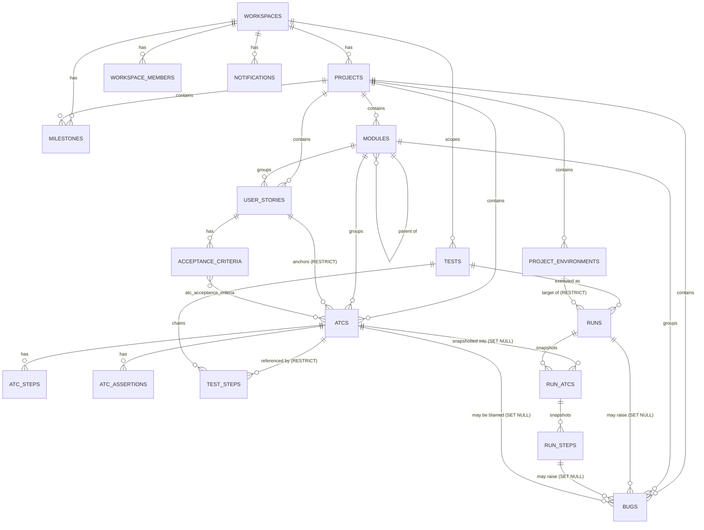
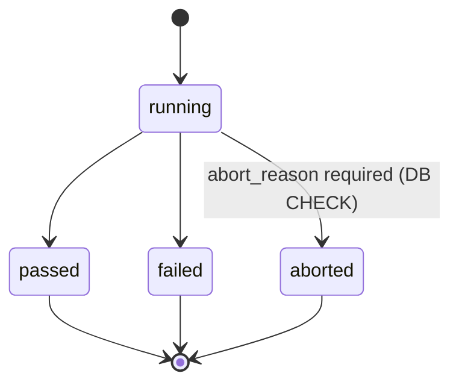
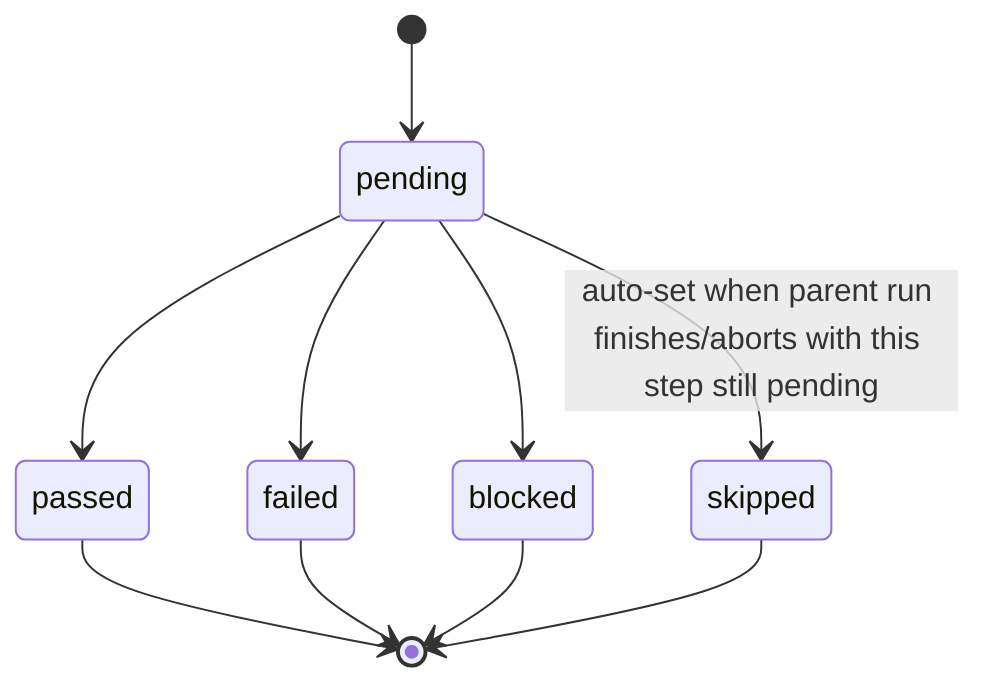
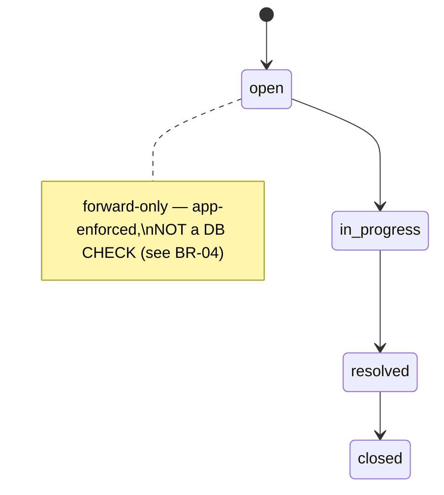
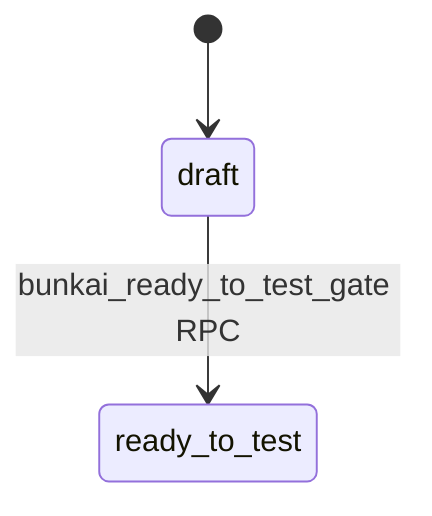
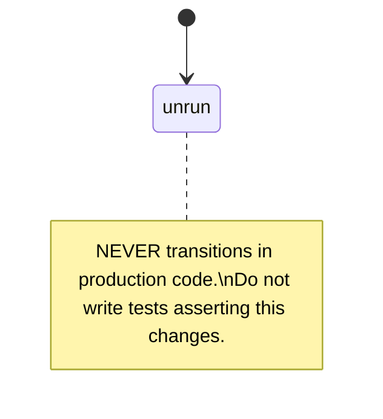
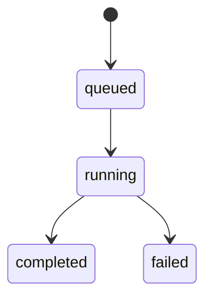

# Domain Glossary — Bunkai (Discovery View)

> Generated by: `/project-discovery` Phase 1, sub-step 4 (Domain Glossary)
> Generated: 2026-08-15
> **Grounding**: Core Entities, Enumerations, and Relationships below are read directly from the **live `staging` Supabase Postgres schema** via the `staging-dbhub` MCP (`information_schema.columns` for column shape; `pg_constraint` for foreign keys and CHECK constraints — the `information_schema` FK/CHECK views returned empty result sets on this instance, so `pg_constraint` was used as a fallback for those two, noted per-section). Business naming, terminology discipline, and state-machine narrative are cross-checked against the target repo's own `.context/business/domain-glossary.md` (its own note: "Last full code-sync: 2026-08-12... every controlled vocabulary below was re-read from the live migrations, API routes and rendered UI strings, not from memory") and `bunkai-qa-engineering/.context/business/business-data-map.md` (2026-08-13).
> **Precedence note**: where this document's terminology disagrees with anything else, the target repo's own `.context/business/domain-glossary.md` wins — it is the team's actively-maintained single source of truth for vocabulary ("Any document, Jira issue, UI copy, or commit that uses one of these terms MUST match the definition here"). This document exists so this QA-engineering repo has its own grounded copy, not to compete with that source.

---

## 1. Core Entities

### Workspace

| Technical Name | Business Name | Description | Table | Key Attributes | Found In |
|---|---|---|---|---|---|
| `workspaces` | Workspace | Multi-tenant root. Every other entity ultimately scopes to one Workspace. | `public.workspaces` | `id` (uuid, PK), `slug` (text), `name` (text), `owner_user_id` (uuid, FK→`auth.users`, `ON DELETE RESTRICT`), `plan` (text, default `'community'`), `created_at` | Live schema (`staging-dbhub`); `business-data-map.md:211` |

**Relationships**: Has many `projects` (CASCADE), has many `workspace_members` (CASCADE, junction to `auth.users`), has many `workspace_invites`, `access_tokens`, `notifications`, `milestones` (all CASCADE on workspace delete).

**Business rule**: `plan` is a genuine billing-tier field (`community | cloud | enterprise`, CHECK-constrained) even though no billing/subscription logic exists yet in code — see `business-model.md` Discovery Gaps for the "revenue model unimplemented" finding. The literal values are load-bearing; do not use the earlier (wrong) "Free/Team/Enterprise" naming still occasionally seen in stale docs (per the target's own glossary §4 anti-glossary entry).

```json
{
  "id": "6f2e1c9a-...",
  "slug": "upex-galaxy",
  "name": "UPEX Galaxy",
  "owner_user_id": "a1b2c3d4-...",
  "plan": "community",
  "created_at": "2026-06-01T12:00:00Z"
}
```

---

### Project

| Technical Name | Business Name | Description | Table | Key Attributes | Found In |
|---|---|---|---|---|---|
| `projects` | Project | The application-under-test container inside a Workspace. Owns Modules, Stories, ATCs, Tests, Runs, Bugs, Milestones, Environments. | `public.projects` | `id`, `workspace_id` (FK, CASCADE), `slug`, `name`, `description`, `created_at` | Live schema; `business-feature-map.md` FEAT-012 |

**Relationships**: Belongs to one `workspace`. Has many `modules`, `user_stories`, `atcs`, `bugs`, `milestones`, `project_environments` (all CASCADE on project delete).

```json
{
  "id": "3d4e5f6a-...",
  "workspace_id": "6f2e1c9a-...",
  "slug": "bunkai-web",
  "name": "Bunkai Web",
  "description": "The core TMS product",
  "created_at": "2026-06-02T09:00:00Z"
}
```

---

### Module

| Technical Name | Business Name | Description | Table | Key Attributes | Found In |
|---|---|---|---|---|---|
| `modules` | Module | First-class, self-referential tree node partitioning a Project's feature surface (depth ≤ 6, soft-delete/archive, one-way). Coverage rollups and defect heatmaps aggregate by Module. | `public.modules` | `id`, `project_id` (FK, CASCADE), `parent_module_id` (FK to `modules.id`, self-ref, CASCADE), `path` (text), `name`, `position` (int), `description`, `archived_at` (nullable — soft delete marker) | Live schema; target glossary §3 ("it is *not* a folder name") |

**Relationships**: Belongs to one `project`; belongs to zero-or-one parent `module` (self-referential); has many child `modules`; has many `user_stories`, `atcs`, `bugs`, `runs` (via `runs.module_id`, `ON DELETE SET NULL`).

**Business rule (CHECK-enforced)**: `modules_path_depth_max_6` — `path` split by `/` must be 1–6 segments deep. `modules_description_max_500` — description capped at 500 chars.

**Given/When/Then**:
- Given a Module already at tree depth 6
- When a user attempts to create a child Module under it
- Then the DB CHECK constraint `modules_path_depth_max_6` rejects the insert (path would resolve to 7 segments)

```json
{
  "id": "9a8b7c6d-...",
  "project_id": "3d4e5f6a-...",
  "parent_module_id": null,
  "path": "auth",
  "name": "Authentication",
  "position": 0,
  "description": "Login, signup, OAuth, PAT issuance",
  "archived_at": null
}
```

---

### User Story (US)

| Technical Name | Business Name | Description | Table | Key Attributes | Found In |
|---|---|---|---|---|---|
| `user_stories` | User Story | Markdown-bodied requirement, optionally linked to an external Jira issue. Carries the **Ready-to-Test gate**. Has 1..N Acceptance Criteria. | `public.user_stories` | `id`, `project_id` (FK), `module_id` (FK, CASCADE), `title`, `description`, `external_id` (Jira key, nullable), `external_url` (nullable), `status` (text, default `'draft'`, CHECK `∈ {draft, ready_to_test}`), `archived_at` | Live schema; target glossary §3 |

**Relationships**: Belongs to one `project` and one `module`. Has many `acceptance_criteria` (CASCADE). Referenced by `atcs.user_story_id` (**RESTRICT** — an ATC anchor blocks Story deletion; asymmetric vs. `acceptance_criteria.user_story_id` which is CASCADE).

**Business rule**: the `ready_to_test` transition is gated by the `bunkai_ready_to_test_gate` SECURITY DEFINER RPC (`business-data-map.md:415`), not a raw UPDATE — a QA engineer should never be able to flip this status via a direct table write even with elevated DB access outside the app.

```json
{
  "id": "b1c2d3e4-...",
  "project_id": "3d4e5f6a-...",
  "module_id": "9a8b7c6d-...",
  "title": "User can sign in with email + password",
  "description": "As a returning user, I want to sign in with my email and password so I can access my workspace.",
  "external_id": "BK-166",
  "external_url": "https://upexgalaxy71.atlassian.net/browse/BK-166",
  "status": "ready_to_test",
  "archived_at": null
}
```

---

### Acceptance Criterion (AC)

| Technical Name | Business Name | Description | Table | Key Attributes | Found In |
|---|---|---|---|---|---|
| `acceptance_criteria` | Acceptance Criterion | Atomic, sortable, Markdown-bodied testable condition of a User Story. The unit an ATC binds to. | `public.acceptance_criteria` | `id`, `user_story_id` (FK, CASCADE), `title`, `description`, `position` (int), `archived_at` | Live schema |

**Relationships**: Belongs to one `user_story`. Many-to-many with `atcs` via `atc_acceptance_criteria`.

```json
{
  "id": "c2d3e4f5-...",
  "user_story_id": "b1c2d3e4-...",
  "title": "Given valid credentials, the user is redirected to /projects",
  "description": "...",
  "position": 0,
  "archived_at": null
}
```

---

### ATC (Acceptance Test Case)

> **Terminology correction, load-bearing**: ATC does **not** stand for "Atomic Test Component" — it stands for **Acceptance Test Case**. The target's own glossary devotes an entire opening section (§0) to this because the wrong expansion previously blocked a ticket for five weeks. "Atomic" and "component" describe *implementation properties* (how an ATC looks once automated in KATA), not the acronym itself. Source: `upex-bunkai-tms/.context/business/domain-glossary.md:13-27`.

| Technical Name | Business Name | Description | Table | Key Attributes | Found In |
|---|---|---|---|---|---|
| `atcs` | ATC (Acceptance Test Case) | Reusable, atomic unit of verification — mandatorily anchored to a User Story + ≥1 Acceptance Criterion. The product's core structural invariant. | `public.atcs` | `id`, `project_id` (FK), `module_id` (FK), `user_story_id` (FK, **RESTRICT**), `slug`, `title`, `layer` (text, CHECK `∈ {UI, API, Unit}`), `version` (int, default 1), `status` (text, default `'unrun'`, CHECK `∈ {pass, fail, blocked, skipped, running, unrun}` — **but confirmed a dead column, see §3 below**), `tags` (text[], max 10), `tsv` (tsvector, full-text search), `archived_at` | Live schema; `business-data-map.md:221` (dead-column confirmation) |
| `atc_steps` | ATC Step | One ordered executable step of an ATC. | `public.atc_steps` | `id`, `atc_id` (FK, CASCADE), `position`, `content`, `input_data`, `expected` | Live schema |
| `atc_assertions` | ATC Assertion | One ordered assertion evaluated at the end of an ATC. | `public.atc_assertions` | `id`, `atc_id` (FK, CASCADE), `position`, `content` | Live schema |
| `atc_acceptance_criteria` | ATC↔AC binding | M:N join enforcing the anchoring invariant. | `public.atc_acceptance_criteria` | `atc_id` (FK, CASCADE), `acceptance_criterion_id` (FK, CASCADE) — composite key, no own PK | Live schema |

**Relationships**: Belongs to one `project`, one `module`, one `user_story` (RESTRICT — cannot delete the Story out from under an ATC). Has many `atc_steps`, `atc_assertions` (CASCADE). Many-to-many with `acceptance_criteria` via `atc_acceptance_criteria`. Referenced by `test_steps.atc_id` (RESTRICT — cannot delete an ATC while a Test chains it) and `run_atcs.atc_id` (**SET NULL** — a Run's history survives ATC deletion via denormalized `atc_title`).

**Business rule (the product's structural promise)**: creation and full-replace editing both run through SECURITY DEFINER RPCs (`bunkai_create_atc` / `bunkai_update_atc`) that validate every `ac_id` belongs to the given `user_story_id` and that `module_id` is the Story's own module or a descendant, **before** the atomic 4-table write (`atcs` + `atc_steps` + `atc_assertions` + `atc_acceptance_criteria`) commits. Source: `business-data-map.md` Flow 5.

**Given/When/Then**:
- Given an ATC creation payload referencing an `ac_id` that does not belong to the given `user_story_id`
- When `POST /api/v1/atcs` is called
- Then the request is rejected before the RPC runs — no partial write, no orphan `atc_steps`

**Correction worth carrying into QA planning**: an earlier internal draft claimed the create/edit RPC had been removed in favor of an unsafe app-layer transaction. This was **flatly wrong** — confirmed by direct query against the migration history, not inferred from a grep miss. Do not write tests defending against an "orphan atc_steps on partial failure" scenario; it was never a real risk. Source: `business-data-map.md:47,240-242,557`.

```json
{
  "id": "d3e4f5a6-...",
  "project_id": "3d4e5f6a-...",
  "module_id": "9a8b7c6d-...",
  "user_story_id": "b1c2d3e4-...",
  "slug": "auth/atc-a1b2c3d4",
  "title": "Login with valid email and password",
  "layer": "UI",
  "version": 2,
  "status": "unrun",
  "tags": ["smoke", "regression"],
  "archived_at": null
}
```

---

### Test

| Technical Name | Business Name | Description | Table | Key Attributes | Found In |
|---|---|---|---|---|---|
| `tests` | Test | Named container owning an **ordered chain of ATC references** (not copies) — "one-edit-many-tests" mechanism. | `public.tests` | `id`, `workspace_id` (FK), `title` (CHECK: 1–200 chars, trimmed), `created_by` (FK→`auth.users`, RESTRICT), `version` (int, default 1), `tags` (text[], validated by a custom function `bunkai_test_tags_shape_ok`) | Live schema |
| `test_steps` | Chain Step | One position in a Test's ATC chain — the stable per-row handle for reordering (a `step_id`, NOT the `atc_id`, since the same ATC may repeat at multiple positions). | `public.test_steps` | `id`, `test_id` (FK, CASCADE), `atc_id` (FK, **RESTRICT**), `position` (CHECK `>= 1`) | Live schema; target glossary §3 (*Chain step*) |

**Relationships**: `tests` belongs to one `workspace` (note: NOT scoped to a `project` directly — workspace-scoped, matching `business-data-map.md:144-146` "workspace-scoped" note). Has many `test_steps` (CASCADE) referencing `atcs` (RESTRICT — cannot delete an ATC while chained into a Test).

**Business rule**: the reserved suite-tag vocabulary is closed to exactly three case-normalized values — `smoke`, `sanity`, `regression` — surfaced as a "Suites:" quick-add control; free custom tags coexist. Source: target glossary §3 (*Reserved suite tag*).

```json
{
  "id": "e4f5a6b7-...",
  "workspace_id": "6f2e1c9a-...",
  "title": "E2E: Full sign-in and workspace switch",
  "created_by": "a1b2c3d4-...",
  "version": 1,
  "tags": ["smoke", "regression", "auth"]
}
```

---

### Project Environment

| Technical Name | Business Name | Description | Table | Key Attributes | Found In |
|---|---|---|---|---|---|
| `project_environments` | Project Environment | Named deploy target (e.g. Staging, Production) a Run executes against, scoped to one Project. | `public.project_environments` | `id`, `project_id` (FK, CASCADE), `name` (CHECK: trimmed, 1–60 chars, unique per project case-insensitive per target glossary) | Live schema; target glossary §3 |

**Relationships**: Belongs to one `project`. Referenced by `runs.environment_id` (**RESTRICT** — cannot delete an Environment while any Run references it, preserving run history).

```json
{ "id": "f5a6b7c8-...", "project_id": "3d4e5f6a-...", "name": "Staging" }
```

---

### Run (execution instance)

| Technical Name | Business Name | Description | Table | Key Attributes | Found In |
|---|---|---|---|---|---|
| `runs` | Run | One execution instance of a Test against an Environment, executed by a human, an AI agent, or CI. Snapshots content so later ATC/Test edits never corrupt history. | `public.runs` | `id`, `workspace_id`, `project_id`, `test_id` (FK, RESTRICT), `environment_id` (FK, RESTRICT), `module_id` (FK, SET NULL), `status` (CHECK `∈ {running, passed, failed, aborted}`), `executor_mode` (CHECK `∈ {human, agent, ci}`), `executor_user_id` (FK, SET NULL), `start_token` (idempotency key material, 1–200 chars), `test_title` (denormalized snapshot), `version`, `started_at`, `finished_at`, `abort_reason` (CHECK: required 3–500 chars **iff** `status='aborted'`, else must be NULL) | Live schema; `business-data-map.md` §4.5 |
| `run_atcs` | Run ATC (snapshot) | Snapshot of one ATC pulled into a Run at start time. Denormalizes `atc_title` so history survives later ATC edits/archival. | `public.run_atcs` | `id`, `run_id` (FK, CASCADE), `atc_id` (FK, SET NULL), `position` (CHECK `>= 1`), `atc_title`, `status` (CHECK `∈ {pending, passed, failed, blocked, skipped}`) | Live schema |
| `run_steps` | Run Step | Per-step result + evidence within a `run_atc`. | `public.run_steps` | `id`, `run_atc_id` (FK, CASCADE), `atc_step_id` (FK, SET NULL), `position` (CHECK `>= 0`), `content`, `input_data`, `expected`, `status` (CHECK `∈ {pending, passed, failed, blocked, skipped}`), `note`, `evidence_url`, `executed_at` | Live schema |

**Relationships**: `runs` belongs to `workspace`, `project`, `test` (RESTRICT), `environment` (RESTRICT), optionally `module` (SET NULL). Has many `run_atcs` (CASCADE), each with many `run_steps` (CASCADE). `run_atcs.atc_id` and `run_steps.atc_step_id` are both SET NULL on source deletion — **the whole point of the snapshot is that Run history is immune to later edits or deletes of the ATC it ran**.

**Business rule (DB-layer, not just app-layer)**: `runs_abort_reason_chk` — a Run cannot be aborted without a 3-500 char reason, enforced as a genuine CHECK constraint, so a crafted request bypassing client/API validation still cannot leave an abort without a reason. Source: `master-test-plan.md:212-213`. On `finish`, any `run_atcs`/`run_steps` still `pending` are auto-transitioned to `skipped` (app-layer trigger behavior, not itself a CHECK constraint — verify this behaviorally, not just by reading the schema).

**Given/When/Then**:
- Given a Run in `status='running'` with an `abort_reason` payload of an empty string
- When `POST /api/v1/runs/{id}/abort` is called (even via a crafted request bypassing the API-layer check)
- Then the DB CHECK constraint `runs_abort_reason_chk` rejects the write — this must hold even if the app-layer validation is somehow bypassed

```json
{
  "id": "a6b7c8d9-...",
  "workspace_id": "6f2e1c9a-...",
  "project_id": "3d4e5f6a-...",
  "test_id": "e4f5a6b7-...",
  "environment_id": "f5a6b7c8-...",
  "status": "running",
  "executor_mode": "human",
  "start_token": "idem-8f3e...",
  "test_title": "E2E: Full sign-in and workspace switch",
  "version": 1,
  "started_at": "2026-08-15T10:00:00Z",
  "abort_reason": null
}
```

---

### Bug

| Technical Name | Business Name | Description | Table | Key Attributes | Found In |
|---|---|---|---|---|---|
| `bugs` | Bug | Native defect record anchored to Module + ATC + Run — lives inside the test cycle, not delegated to Jira (optional one-way sync). | `public.bugs` | `id`, `workspace_id`, `project_id`, `module_id` (FK, CASCADE), `run_id` (FK, SET NULL), `run_step_id` (FK, SET NULL), `atc_id` (FK, SET NULL), `title` (CHECK: trimmed, 5–200 chars), `severity` (CHECK `∈ {P1, P2, P3, P4}`), `status` (CHECK `∈ {open, in_progress, resolved, closed}`, default `'open'`), `description`, `steps_to_reproduce` (default `''`), `evidence_urls` (text[], max 10), `created_by` (FK, SET NULL), `assignee_user_id` (FK, SET NULL) | Live schema; target glossary §3 |

**Relationships**: Belongs to `workspace`, `project`, `module` (CASCADE). Optionally references `run`, `run_step`, `atc` (all SET NULL — a Bug survives the Run/ATC it was filed against being deleted, unlike the Run/ATC's own internal history which is immune the other way).

**Business rule (DB-layer integrity guard)**: the `bugs_check_consistency` trigger (not visible as a CHECK constraint — a BEFORE INSERT/UPDATE trigger per `business-data-map.md:469`) validates that `run_step_id`/`atc_id`/`run_id`/`project_id` genuinely belong together before allowing the insert — a crafted payload referencing mismatched entities is rejected at the DB layer, not just app validation.

**Business rule (severity/status rendering)**: `severity` is stored as `P1`/`P2`/`P3`/`P4` but rendered everywhere in the UI as words — `P1`=Critical, `P2`=Major, `P3`=Minor, `P4`=Trivial. Both forms are canonical in their own layer (use P-codes in API/schema/Jira-field talk, words in UI copy/ACs/prose) — never invent a third scale. `status` transitions are **forward-only** (`open → in_progress → resolved → closed`), enforced procedurally by app code review discipline, **not** a DB CHECK constraint (confirmed: no ordering CHECK exists on `bugs.status` in the live schema — only the value-membership CHECK). Source: target glossary §3 (*Bug Severity*, *Bug Status lifecycle*); `business-feature-map.md` FEAT-048 (forward-only, BK-264).

**Given/When/Then**:
- Given a Bug currently in `status='resolved'`
- When a request attempts `POST /bugs/{id}/status` with `status='in_progress'` (moving backward)
- Then the app rejects the transition — but because this is **not** DB-CHECK-enforced (only the value set is), a QA session should specifically test this via the API, not assume a raw SQL UPDATE would also be blocked

```json
{
  "id": "b7c8d9e0-...",
  "workspace_id": "6f2e1c9a-...",
  "project_id": "3d4e5f6a-...",
  "module_id": "9a8b7c6d-...",
  "run_id": "a6b7c8d9-...",
  "run_step_id": null,
  "atc_id": "d3e4f5a6-...",
  "title": "Login redirect fails on slow network",
  "severity": "P2",
  "status": "open",
  "steps_to_reproduce": "1. Throttle network to Slow 3G\n2. Sign in with valid credentials\n3. Observe redirect never fires",
  "evidence_urls": []
}
```

---

### Milestone

| Technical Name | Business Name | Description | Table | Key Attributes | Found In |
|---|---|---|---|---|---|
| `milestones` | Milestone | Project-level goal with a target date. | `public.milestones` | `id`, `workspace_id`, `project_id` (FK, CASCADE), `name` (CHECK: normalized whitespace, 1–100 chars), `target_date` (date), `description` (CHECK ≤ 500 chars, default `''`), `created_by` (FK, SET NULL) | Live schema |

**Relationships**: Belongs to `workspace`, `project` (CASCADE).

**Business rule (deliberate UI restraint)**: the date chip renders "Due today" / "N days left" / "N days past target" — **never** "Overdue". Readiness cannot be computed until the (not-yet-shipped) Test Plan aggregation lands, so the UI states the date fact rather than asserting a judgement it can't support. This is a ratified product decision, not a bug to "fix". Source: target glossary §3 (*Milestone*), §4 anti-glossary row.

```json
{
  "id": "c8d9e0f1-...",
  "workspace_id": "6f2e1c9a-...",
  "project_id": "3d4e5f6a-...",
  "name": "Sprint 14 — Notifications GA",
  "target_date": "2026-09-01",
  "description": "All notification triggers live and stable"
}
```

---

### Notification

| Technical Name | Business Name | Description | Table | Key Attributes | Found In |
|---|---|---|---|---|---|
| `notifications` | Notification | Record of a workspace event delivered to a member's inbox. Written entirely by DB triggers, not app code. | `public.notifications` | `id`, `workspace_id`, `recipient_user_id` (FK, CASCADE), `event_type` (**free-text — no CHECK constraint**, unlike most other status/enum columns), `entity_type` (free-text), `entity_id`, `payload` (jsonb), `read_at`, `source_event_id` | Live schema |

**Relationships**: Belongs to `workspace`, one `recipient` user (CASCADE — deleting the user deletes their notifications).

**Discovery note**: `event_type`/`entity_type` are genuinely unconstrained at the DB layer (confirmed — not in the CHECK constraint list), a deliberate asymmetry vs. `bugs.status`/`runs.status`/etc. This means a QA session validating notification content needs to check the actual emitted values against `upex-bunkai-tms/.context/business/events.md` (the target's own event catalog — `atc.created`, `module.renamed`, `run.finished`, `bug.assigned`, etc.), not a DB constraint, since the DB will accept any string here.

---

## 2. Enumerations and Constants

All values below are read directly from live `pg_constraint` CHECK clauses on `staging` (not paraphrased).

| Table.Column | Values | Business Meaning | Found In |
|---|---|---|---|
| `atcs.layer` | `UI`, `API`, `Unit` | What kind of test the ATC is | `atcs_layer_check` |
| `atcs.status` | `pass`, `fail`, `blocked`, `skipped`, `running`, `unrun` | **Domain allows all 6, but `business-data-map.md:221,419-426` confirms only `'unrun'` is EVER written by any production code path — this is a dead column.** Real per-execution status lives on `run_atcs.status`/`run_steps.status`. Do not write tests asserting this column transitions. | `atcs_status_check` + business-data-map correction |
| `bugs.severity` | `P1`, `P2`, `P3`, `P4` | Rendered UI: Critical, Major, Minor, Trivial respectively | `bugs_severity_check` |
| `bugs.status` | `open`, `in_progress`, `resolved`, `closed` | Forward-only lifecycle (app-enforced, not DB-CHECK-ordered) | `bugs_status_check` |
| `run_atcs.status` / `run_steps.status` | `pending`, `passed`, `failed`, `blocked`, `skipped` | Position-grain execution result. `pending` renders as **"Unrun"** in the UI verdict badge — spoken/UI word differs from the stored literal | `run_atcs_status_check`, `run_steps_status_check`; target glossary §3 (*Run-status grain split*) |
| `runs.status` | `running`, `passed`, `failed`, `aborted` | Run-grain (whole-execution) terminal outcome. `aborted` is a run-grain-only terminal state — never appears at the position grain (a step is `skipped`, never `aborted`) | `runs_status_check` |
| `runs.executor_mode` | `human`, `agent`, `ci` | Who drove the Run | `runs_executor_mode_check` |
| `user_stories.status` | `draft`, `ready_to_test` | A gate, not a workflow — exactly two states, no intermediate | `user_stories_status_check` |
| `workspace_members.role` | `viewer`, `member`, `admin`, `owner` | Role hierarchy: `viewer ⊂ member ⊂ admin ⊂ owner` | `workspace_members_role_check`; `business-api-map.md` §7 |
| `workspace_members.status` | `active`, `invited`, `suspended` | Membership lifecycle | `workspace_members_status_check` |
| `workspaces.plan` | `community`, `cloud`, `enterprise` | Billing tier — **shipped literals**; the earlier "Free/Team/Enterprise" naming is banned (target glossary §4). No billing logic exists yet to gate on this field (see `business-model.md` Discovery Gaps). | `workspaces_plan_check` |
| `access_tokens.scopes` (PAT scopes) | `atc:read`, `atc:write`, `run:execute`, `workspace:admin` | Bearer-token capability scopes | `access_tokens_scopes_nonempty`/`_allowed`; `business-api-map.md` §2 |
| `workspace_invites.role` | `viewer`, `member`, `admin` | Invite-assignable roles (note: `owner` is NOT invite-assignable — only the bootstrap creator gets it) | `workspace_invites_role_check` |
| `import_jobs.status` | `queued`, `running`, `completed`, `failed` | Jira import job lifecycle | `import_jobs_status_check` |
| `notification_preferences.event_type` | `run_lifecycle`, `bug_lifecycle`, `mentions` | Coarse subscription category — **deliberately not reconciled** with the fine-grained `activity_log.action` vocabulary (`atc.created`, `run.finished`, etc.) | `notification_preferences_event_type_check`; target glossary §3 (*Activity event*) |
| `notification_preferences.channel` | `in_app`, `email` | Delivery channel — `email` channel exists as a preference option even though Resend (email delivery) is confirmed unwired in code (`business-data-map.md` GAP-5) | `notification_preferences_channel_check` |
| `feature_flags.scope` | `global`, `workspace` | Scope of a flag row — **moot in practice**: `feature_flags` table is queried zero times anywhere in the codebase (`business-feature-map.md` FEAT-042 correction) | `feature_flags_scope_check` |

---

## 3. Business Rules

### BR-01 — ATC anchoring invariant (the product's core promise)

**Description**: An ATC cannot exist without a User Story and at least one Acceptance Criterion.
**Entities affected**: `atcs`, `atc_acceptance_criteria`, `user_stories`, `acceptance_criteria`
**Validation**: application-layer pre-check inside `bunkai_create_atc`/`bunkai_update_atc` RPCs, backed by `atcs.user_story_id NOT NULL` + FK RESTRICT, and `atc_acceptance_criteria` composite FK (no orphan rows possible at the join-table level either).
**Error message**: not directly observed this pass — Discovery Gap (see §8).
**Found in**: `business-data-map.md:60,274-287`; live schema (`atcs.user_story_id` is `NOT NULL`).

- **Given** an ATC-creation payload with `ac_ids: []` (no Acceptance Criteria referenced)
- **When** `POST /api/v1/atcs` is called
- **Then** the request is rejected before the RPC transaction runs — this is the single highest-value regression check for the whole product per `master-test-plan.md` §2.6

### BR-02 — Run abort requires a reason (DB-layer, not just API-layer)

**Description**: A Run cannot be aborted without a non-empty reason (3–500 chars).
**Entities affected**: `runs`
**Validation**: `runs_abort_reason_chk` CHECK constraint (`abort_reason` required iff `status='aborted'`, else must be NULL).
**Found in**: live schema; `master-test-plan.md:212-213,419`.

- **Given** a running Run
- **When** an abort request is sent with an empty/whitespace `abort_reason`
- **Then** rejected at the DB layer even if a crafted request bypasses the API-layer validation — worth testing both layers independently, since a bypass of one without the other is the actual risk being guarded against

### BR-03 — Bug referential consistency (DB trigger, not CHECK)

**Description**: A Bug's `run_step_id`/`atc_id`/`run_id`/`project_id` must all genuinely belong to the same execution chain.
**Entities affected**: `bugs`, `run_steps`, `run_atcs`, `runs`, `atcs`, `projects`
**Validation**: `bugs_check_consistency` BEFORE INSERT/UPDATE trigger (not a CHECK constraint — confirmed no matching CHECK exists in the live constraint list for `bugs`).
**Found in**: `business-data-map.md:231,469`; `master-test-plan.md` §2.7.

- **Given** a bug-filing payload referencing a `run_step_id` from Run X but an `atc_id` that belongs to a different, unrelated Run
- **When** `POST /api/v1/bugs` is called
- **Then** the `bugs_check_consistency` trigger rejects the insert

### BR-04 — Bug status is forward-only (app-enforced, not DB-CHECK-ordered)

**Description**: `bugs.status` may only move `open → in_progress → resolved → closed`, never backward.
**Entities affected**: `bugs`
**Validation**: **confirmed app-layer only** — the live CHECK constraint (`bugs_status_check`) constrains the value *set*, not the transition *order*. No trigger or CHECK enforces monotonicity at the DB layer.
**Found in**: target glossary §3 (*Bug Status lifecycle* — "enforced procedurally, not by a CHECK constraint, so it is a rule a reviewer must hold rather than one the database refuses"); `business-feature-map.md` FEAT-048 (BK-264).

- **Given** a Bug in `status='closed'`
- **When** a raw/crafted request attempts to set `status='open'`
- **Then** the API should reject it — **but this is a genuine DB-layer gap worth a dedicated negative test**, since nothing at the schema level prevents it if the API check were ever bypassed

### BR-05 — Module tree depth cap

**Description**: A Module's tree path may be at most 6 segments deep.
**Entities affected**: `modules`
**Validation**: `modules_path_depth_max_6` CHECK constraint.
**Found in**: live schema; `master-test-plan.md:389`.

- **Given** a Module already at path depth 6 (e.g. `a/b/c/d/e/f`)
- **When** a user attempts to create a 7th-level child
- **Then** the CHECK constraint rejects the insert

### BR-06 — Idempotency-Key is hard-required on Run start

**Description**: `POST /api/v1/runs` requires an `Idempotency-Key` header; the same key within a 24h window returns the original Run rather than creating a duplicate.
**Entities affected**: `runs`, `idempotency_keys`
**Validation**: application-layer, backed by the `idempotency_keys` table (`status ∈ {pending, succeeded, failed}`).
**Found in**: `business-api-map.md` GAP-15; `master-test-plan.md` §2.4.

- **Given** two `POST /runs` requests with the identical `Idempotency-Key` sent within 24 hours
- **When** the second request is processed
- **Then** it returns the first Run's data, not a new Run row

---

## 4. Entity Relationships Diagram



Source: live `pg_constraint` foreign-key query against `staging`, cross-checked against `business-data-map.md` §2 entity map (which matches).

---

## 5. Terminology Mapping

### Technical → Business

| Technical term | Business term | Notes |
|---|---|---|
| `atcs` / ATC | Acceptance Test Case | NOT "Atomic Test Component" — see §1 ATC entry |
| `tests` / Test | Test (ordered chain of ATCs) | NOT a synonym for "test case" — a Test is the *chain*, ATCs are the chained units |
| `runs` | Run | One execution instance, not the Test itself |
| `bugs` | Bug | Native defect record; distinct from "Defect" (a formal-specification-deviation concept in the IQL methodology, §2 of the target glossary) |
| `user_stories` | User Story (US) | — |
| `acceptance_criteria` | Acceptance Criterion (AC) | — |
| `modules` | Module | NOT "folder" — first-class entity with its own metrics |
| `workspaces` | Workspace | Multi-tenant root — NOT "organization" or "team" (those words appear nowhere in code) |
| `test_steps` row | Chain step | Reorder handle is the row's own `id` (aka `step_id`), never the `atc_id` |
| `run_atcs.status = 'pending'` | "Unrun" (UI) | Stored literal and spoken/rendered word differ — quote `pending` in schema/API talk, "Unrun" in UI copy |
| `runs.executor_mode = 'human'` | "Human" (Run History) / "Manual" (Home dashboard) | Known, unruled UI vocabulary drift — see target glossary §5 |

### Abbreviations and Acronyms

| Acronym | Expansion |
|---|---|
| ATC | Acceptance Test Case |
| US | User Story |
| AC | Acceptance Criterion |
| TC | Test Case (TMS-generic term; in Bunkai specifically materializes as a Test = ordered ATC chain) |
| TMS | Test Management System |
| PAT | Personal Access Token |
| KATA | Component Action Test Architecture (this QA-engineering repo's own test-automation architecture — Bunkai's name and product philosophy directly reference it) |
| IQL | Integrated Quality Lifecycle |
| RLS | Row Level Security (Postgres/Supabase) |
| RPC | Remote Procedure Call — in this codebase specifically means a Supabase SECURITY DEFINER Postgres function |

Source: `upex-bunkai-tms/.context/business/domain-glossary.md` §1, reproduced/summarized with attribution — that document is the canonical, actively-maintained upstream; consult it directly for the full acronym table and the "Known UI vocabulary drift" (§5) and "Anti-glossary" (§4) sections, which are too large to duplicate here in full without drifting out of sync.

---

## 6. Status / State Flows

### `runs.status`



### `run_atcs.status` / `run_steps.status` (position grain)



**Note**: `aborted` never appears at this grain — it is a `runs.status`-only terminal outcome (target glossary §3, *Run-status grain split*).

### `bugs.status`



### `user_stories.status`



**Note**: a gate, not a rich workflow — exactly two states, no intermediate. "user_story_reverted" fires as an *event* (not a third status value) when the last active AC is deleted (`business-data-map.md:415`).

### `atcs.status` — confirmed dead, included for completeness only



### `import_jobs.status`



---

## 7. UI Labels Reference

| Stored value | Rendered UI label | Screen | Found In |
|---|---|---|---|
| `bugs.severity = P1` | Critical | Bug forms, lists | target glossary §3 |
| `bugs.severity = P2` | Major | Bug forms, lists | target glossary §3 |
| `bugs.severity = P3` | Minor | Bug forms, lists | target glossary §3 |
| `bugs.severity = P4` | Trivial | Bug forms, lists | target glossary §3 |
| `run_atcs.status = pending` | "Unrun" | Verdict badge (tree/list/autocomplete) | target glossary §3 (*status_dot*) |
| `run_atcs.status = passed`/`failed` | "Passed"/"Failed" (long) or "Pass"/"Fail" (short, on per-step mark buttons and traceability chip) | Runner, activity copy vs. traceability chip | target glossary §5 |
| `runs.executor_mode = human` | "Human" (Run History, project Run report) / "Manual" (Home active-runs panel) | Two different screens, unruled drift | target glossary §5 |
| An AC bound to an ATC but never executed | "awaiting execution" (Home coverage) / "Never run" (project Coverage screen) | Two different screens, unruled drift | target glossary §5 |
| `user_stories.status = draft`/`ready_to_test` | "Draft" / "Ready to test" badge, with a "Mark ready to test" action | Story detail | target glossary §3 |
| Milestone target-date proximity | "Due today" / "N days left" / "N days past target" — never "Overdue" | Milestone list/detail | target glossary §3, §4 |
| `workspace_members.role` | viewer/member/admin/owner rendered as-is (title-cased) | Member management | inferred, not directly UI-verified this pass |

**Action buttons** (from `bugs.status` forward-only lifecycle): "Start progress" (open→in_progress), "Mark resolved" (in_progress→resolved), "Close" (resolved→closed) — exactly one forward action offered per state. Source: target glossary §3.

---

## 8. Discovery Gaps

- [ ] **ATC-anchoring rejection error message/shape not directly observed this pass.** BR-01 is confirmed as enforced, but the exact error code/message returned by `POST /api/v1/atcs` on a violation was not captured — read `app/api/v1/atcs/route.ts` directly before writing a negative-test assertion against a specific error string.
- [ ] **`bugs.status` backward-transition rejection not confirmed to be tested anywhere.** BR-04 flags this as app-enforced-only (no DB CHECK on transition order) — worth a dedicated QA session verifying the API genuinely rejects a backward transition, since the DB itself would accept it.
- [ ] **Frontend component-level confirmation of the UI Labels Reference (§7) is inherited from the target's own glossary, not independently re-verified against rendered screens this pass.** Treat §7 as high-confidence (the source document states it was read from live shipped UI strings on 2026-08-12) but not re-verified by this discovery session directly.
- [ ] **`tests.tags` validation function `bunkai_test_tags_shape_ok` was not read this pass** — the CHECK constraint calls a custom SQL function rather than an inline expression; if tag-validation edge cases matter for a test plan, read that function's definition directly rather than assuming the three reserved values (`smoke`/`sanity`/`regression`) are the only rule it enforces.
- [ ] **State machine narrative for `workspace_invites` and `access_tokens` (revocation, expiry) was not independently re-derived from schema this pass** — carried from `business-data-map.md`/`business-api-map.md` rather than re-queried; both are unchanged/stable per those documents, so risk of drift is low but not zero.
- [ ] **`notifications.event_type`/`entity_type` free-text values are only known via the target's own `events.md` catalog, not enumerable from the DB schema itself** (confirmed no CHECK constraint exists). If a new event type is added to the app without updating `events.md`, this glossary would not catch the drift — cross-check `events.md`'s "Last full code-sync" date before trusting it for a new feature.

---

## 9. QA Usage Guide

- **Before writing any test case touching ATCs, Tests, or Runs**: read §3 Business Rules (BR-01 through BR-06) first — these are the DB-layer invariants worth a dedicated negative-test slot, not just an implicit assumption baked into a happy-path test.
- **Before naming a status value in a test assertion**: check §2 Enumerations against the live CHECK constraint, not against UI copy — §7 UI Labels Reference exists specifically because the stored value and the rendered word frequently differ (e.g. `pending` → "Unrun").
- **Before writing a test that references "the traceability chain"**: confirm which sense is meant — the methodology sense (US↔ATP↔ATR↔TC, an IQL/KATA concept this QA-engineering repo itself uses) or the product sense (the shipped `GET /projects/{id}/traceability` screen, AC→ATC→Test→Run→Bug). They are both correct and both real; conflating them produces an ambiguous test name. See target glossary §3 (*Traceability chain (product sense)*) and §4's anti-glossary row for the disambiguation rule.
- **Before testing anything billing/plan-related**: check `.context/business/business-model.md` Discovery Gaps first — the `workspaces.plan` field exists and is CHECK-constrained, but zero billing/subscription logic exists in code. A ticket referencing "Enterprise-only" behavior is testing against the vision doc, not shipped reality, until proven otherwise.
- **When in doubt about a term's canonical spelling/meaning**: this document is a discovery-time snapshot; the actively-maintained source of truth is `upex-bunkai-tms/.context/business/domain-glossary.md` (read-only reference in the target repo) — re-read it directly for anything not reproduced here, especially §4 (Anti-glossary — terms to never use) and §5 (Known UI vocabulary drift), both of which are larger than what's excerpted in this document's §5/§7.
- **State machines (§6) are the QA-critical section for regression coverage**: every transition edge shown is a candidate test case; every *missing* edge (e.g. `aborted` never appearing at the `run_atcs`/`run_steps` grain) is a candidate negative test.
