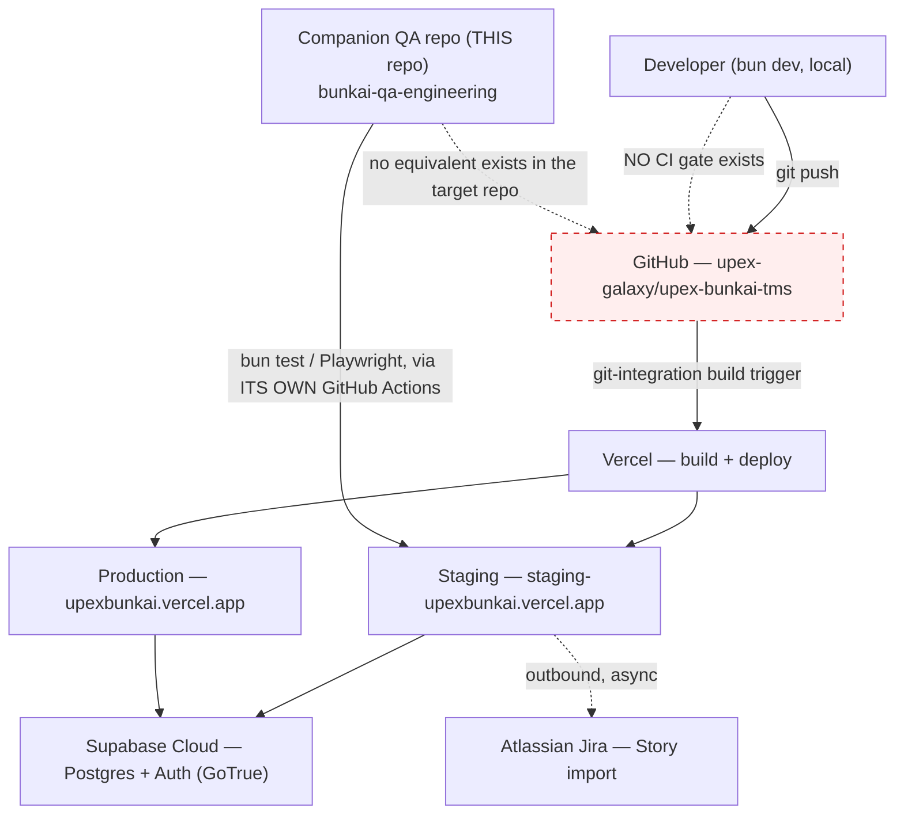
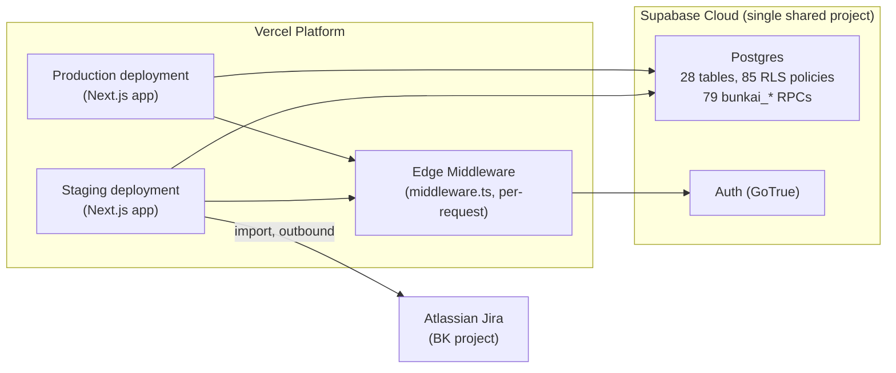

# Infrastructure — CI/CD, Deployment, Environments

> Generated by: `/project-discovery` Phase 3, sub-step 3 (Infrastructure Mapping)
> Generated: 2026-08-15
> Target repo assessed: `upex-bunkai-tms` at `staging` HEAD (`de670c4`) — single Next.js 15 App Router app.
> Sources: `find upex-bunkai-tms -iname "*.yml"/"*.yaml"` under `.github/`, `ls` on repo root for `Dockerfile`/`docker-compose.yml`/`vercel.json`, `lib/urls.ts`, `.gitignore`, `.env.example`, `dbhub.toml`, `supabase/migrations/README.md`, `.agents/project.yaml` (this QA repo), the target's own `.claude/skills/{deploy-to-vercel,vercel-cli}` + its `README.md`; live `GET /api/v1/health` `curl` against both deployed hostnames (read-only, no mutation).
> Reuses: `architecture.md` §External Services, §Security Architecture, §Performance Hooks (Observability finding) — not re-derived here.

---

## Overview Diagram



**Note on the diagram**: the dashed "NO CI gate exists" edge is deliberate — there is no automated step between `git push` and a Vercel build triggering. Whatever quality gate exists (lint/types/tests) runs only via local Husky hooks, which are bypassable (`git commit --no-verify`).

---

## CI/CD Configuration

### Target repo (`upex-bunkai-tms`): **No CI/CD pipeline exists**

Confirmed: `find upex-bunkai-tms -iname "*.yml" -o -iname "*.yaml"` under `.github/` returns nothing; `.github/workflows/` does not exist in the target repo. This is not an inference — it is a direct filesystem fact, consistent across all three prior discovery passes (`project-config.md`, `architecture.md`, target's own `CLAUDE.md` Phase-1 assessment).

What DOES run, locally only, via Husky (`.husky/pre-commit`):

```bash
bunx lint-staged          # eslint --fix on staged .ts/.tsx/.js/.jsx; prettier --write on staged json/yml/css/html
bun run types:check       # tsc --noEmit
bun run vars:check        # .agents/project.yaml var-usage lint
bun run skills:check      # lints this repo's own .claude/skills/
# + skills:registry:check, conditionally, only when skill files are staged
```

These are **pre-commit** hooks — they run on the developer's machine, are bypassable with `--no-verify` (a pattern this QA-engineering repo's own rules explicitly forbid for itself but cannot enforce on the target repo), and never execute for a push that skips the hook or comes from a different machine/CI runner. `bun test` (138 test files) is **not** wired into any hook — it must be run manually.

### Companion QA repo (`bunkai-qa-engineering` — THIS repo): the only CI surface touching Bunkai

This repo's own `.github/workflows/` (confirmed present: `build.yml`, `regression.yml`, `sanity.yml`, `smoke.yml`) is the **only automated quality gate that exists anywhere in the Bunkai ecosystem**. It runs Playwright E2E/API suites against the deployed `staging` environment — it does not, and cannot, gate what gets merged/deployed in `upex-bunkai-tms` itself, since that repo has no CI trigger to hook into. Release confidence for Bunkai depends entirely on: (a) this repo's suites passing against `staging` before a Jira ticket is marked `Tested`, and (b) manual developer discipline running `bun run repo:check` before pushing.

---

## Deployment Configuration

### Hosting platform: **Vercel** — confirmed via converging evidence (no `vercel.json` exists, so this is inferred from multiple independent code/config signals rather than a single explicit file)

| Evidence | What it shows |
|---|---|
| `lib/urls.ts` reads `process.env.VERCEL_ENV` (Vercel's own system env var, not a custom one) to pick between `local`/`staging`/`production` `APP_URLS` | The app is written specifically for Vercel's deployment env model |
| `.gitignore` contains a `.vercel` entry | Standard artifact of `vercel link` / Vercel CLI usage in local dev |
| `.env.example` comment: *"Copy all Supabase vars at once from Vercel → Project Storage → Quickstart → Copy Snippet"* | Confirms a live Vercel↔Supabase native integration is configured on the actual project |
| Target repo's own `.claude/skills/deploy-to-vercel` + `.claude/skills/vercel-cli`, referenced by its `README.md` for `/sprint-development`'s "staging + production deploys; verification, env sync, debug, rollback" | The team's own AI-agent tooling is built around Vercel deploys |
| **Live-verified this pass**: `GET https://staging-upexbunkai.vercel.app/api/v1/health` → `200 {"env":"staging"}`; `GET https://upexbunkai.vercel.app/api/v1/health` → `200 {"env":"production"}` | Both hostnames resolve to real, running Vercel deployments reporting the exact `env` value `VERCEL_ENV`-derived code would produce |

**This closes the Phase 1 Discovery Gap "deploy mechanism unconfirmed."** Vercel is confirmed as the hosting platform with high confidence. What remains unconfirmed: whether the deploy trigger is git-integration auto-deploy (push → build, the "ideal state" the target's own `deploy-to-vercel` skill describes) versus a manual `vercel deploy` CLI invocation per release — no `vercel.json` exists to pin build-command overrides, and Vercel project dashboard settings are outside repo scope to read.

### Docker / Compose

**Not present.** No `Dockerfile`, no `docker-compose.yml`/`.yaml` anywhere in the target repo. Consistent with a Vercel-native deploy (Vercel builds directly from the Next.js source, no container image required) — not a red flag per the skill's own stack-detection gotcha ("missing Dockerfile is not a red flag" when a platform like Vercel builds without one).

---

## Environments Matrix

| Environment | URL | Branch (inferred) | Auto Deploy | Verified live this pass |
|---|---|---|---|---|
| Development | `http://localhost:3000` | — (local `bun dev`) | — | Not applicable (local-only) |
| Staging | `https://staging-upexbunkai.vercel.app` | `staging` (697 commits ahead of `main` per `project-config.md`) | Presumed Vercel git-integration (unconfirmed trigger mechanism) | ✅ `200 {"env":"staging"}` |
| Production | `https://upexbunkai.vercel.app` | `main` (presumed) | Presumed Vercel git-integration (unconfirmed trigger mechanism) | ✅ `200 {"env":"production"}` — **see finding below** |
| QA | Not provisioned | n/a | n/a | No code/DNS evidence found — matches `.agents/project.yaml`'s `qa: null` |

### ⚠️ Notable finding: production is live, contradicting `.agents/project.yaml`'s `null`

`.agents/project.yaml` (this QA repo) marks `environments.production` as `null`, annotated "not yet provisioned for this project." The live `curl` check this pass shows the opposite: `https://upexbunkai.vercel.app/api/v1/health` responds `200` with `env: "production"` — a real, running deployment exists. This is **not** treated as a bug to fix (out of this task's write scope, and this QA repo's own `testing.default_env: staging` already correctly excludes production from the QA target regardless of whether the URL is null or filled). It is reported here as a factual discrepancy for the team to reconcile: either (a) production exists and is intentionally out of this QA project's testing scope by policy — in which case `.agents/project.yaml` is accurate about *scope* even though the environment itself is not absent, or (b) the `null` was meant literally ("not provisioned") and should be corrected to reflect that a production deployment does in fact exist. Not something this discovery pass should silently resolve by editing `project.yaml`.

---

## Environment Variables by Environment

| Variable family | Local | Staging / Production |
|---|---|---|
| Supabase (`NEXT_PUBLIC_SUPABASE_URL`, anon/service-role pair — both naming styles, see `backend.md`) | `.env` (gitignored) | Vercel project environment variables (per-environment scoping is a Vercel platform feature — not independently verified which vars are scoped to which Vercel environment) |
| `NEXT_PUBLIC_APP_URL` | `http://localhost:3000` (`.env.example` default) | Not independently verified whether this is set per-environment in Vercel, or whether `lib/urls.ts`'s `VERCEL_ENV`-driven `APP_URLS` map is the actual source of truth at runtime (the two mechanisms could disagree if `NEXT_PUBLIC_APP_URL` were set to the wrong value on a given Vercel environment — flagged as a gap) |
| `ATLASSIAN_*` / Jira | `.env` (gitignored) | Vercel project environment variables (inferred, not confirmed) |
| `SUPABASE_SERVICE_ROLE_KEY` etc. | `.env` (gitignored) | Vercel project environment variables — **never** the `staging-dbhub` MCP's own read-only `qa_inspector_ro` role credential (that is a QA-side, separate, read-only DB access path documented in `dbhub.toml`, not an app-runtime secret) |

---

## Secrets Management

| Mechanism | Scope | Evidence |
|---|---|---|
| `.env` file (gitignored) | Local development | `.gitignore`, `.env.example` header comment |
| Vercel project environment variables | Staging + Production (inferred from the Vercel hosting confirmation above) | No direct read access to Vercel's dashboard from this repo — inferred, not independently verified |
| **No secret manager found** | n/a | No Vault, AWS Secrets Manager, Doppler, or 1Password CLI dependency in `package.json`; confirmed already in `architecture.md` §Security Architecture |
| Read-only DB access for QA (`qa_inspector_ro.<project-ref>`) | This QA repo's `staging-dbhub` MCP only | `dbhub.toml` — session pooler (port 5432), explicitly NOT the transaction pooler (port 6543, disallows prepared statements); real password lives in the credentials Jira Epic (BK-29), never in a repo file |

No secret VALUES were read or are reproduced anywhere in this document — key names and storage mechanisms only, per instructions.

---

## Cloud Services

| Service | Provider | Purpose | Wired? |
|---|---|---|---|
| Postgres + Row Level Security | Supabase Cloud | Primary datastore, 28 tables, 85 RLS policies, 79 `bunkai_*` RPCs | ✅ Live |
| Auth (GoTrue) | Supabase Cloud | Session/OTP/OAuth issuance | ✅ Live |
| Hosting / build / edge | Vercel | App hosting, build pipeline, edge middleware execution | ✅ Live (confirmed above) |
| Issue tracker (outbound import) | Atlassian Jira | One-directional Story import into Bunkai | ✅ Live |
| Transactional email | Resend | Provisioned (`RESEND_API_KEY` documented) | ❌ **Not wired** — zero call sites in app code |
| Error tracking / analytics | Sentry / PostHog | Described in the target's own architecture docs | ❌ **Not implemented** — zero packages, zero init code |

---

## Database Infrastructure

| Property | Value | Source |
|---|---|---|
| Provider | Supabase Cloud | `.agents/project.yaml`, `dbhub.toml` |
| Project ref | `fmbpikzpkafptqximhxn` | `supabase/migrations/README.md` (an identifier, not a credential — committed openly in the target's own repo) |
| Region | **Not discoverable** — no explicit region config found in any repo file | Discovery Gap |
| Backups | **Not documented in-repo** — Supabase manages backups at the platform level; no repo file asserts a backup policy, retention window, or PITR configuration | Discovery Gap |
| Connection method (app) | PostgREST/RPC via `@supabase/supabase-js` — not a raw pooled connection | `backend.md` |
| Connection method (QA read access) | Session pooler, port 5432, `qa_inspector_ro` role — explicitly not the transaction pooler (disallows prepared statements) | `dbhub.toml` |
| Migration ledger | `supabase_migrations.schema_migrations`, applied via Supabase MCP `apply_migration` — not a CLI-driven migration tool | `supabase/migrations/README.md` |

---

## Infrastructure Resources



**Note**: staging and production appear to share a single Supabase project (no separate `project-ref` was found for a second environment) — not independently confirmed since Vercel dashboard project settings are out of repo-read scope; flagged as a gap below because it materially affects test-data isolation if true (a staging QA write could theoretically be visible to production, or vice versa, if they share the same database).

---

## IaC (Infrastructure as Code)

**Not present.** No `terraform/`, `*.tf` files, `Pulumi.yaml`, `cdk.json`, `serverless.yml`, or `ansible/` directory found anywhere in the repo. All infrastructure (Vercel project, Supabase project) is presumed provisioned through each platform's own dashboard/CLI, not version-controlled as code.

---

## Monitoring & Observability

**Not implemented** — reusing the finding already established in `architecture.md` §Performance Hooks / `project-config.md`: zero `@sentry/*` or `posthog-*` packages in `package.json`, zero init code found. No uptime monitoring (UptimeRobot/Pingdom/BetterStack), no APM (Datadog/New Relic/Grafana Cloud), no structured log-shipping destination beyond whatever Vercel's own function logs retain by default (retention policy not confirmed — Vercel dashboard, out of repo scope).

The only in-app "observability" primitive found is `lib/api/handler.ts`'s per-request structured access log and request-ID propagation (already documented in `architecture.md`'s Component Structure table) — this produces log lines, not a queryable dashboard or alerting system.

---

## Deployment Checklist

> Derived from the absence of CI (nothing enforces these automatically) plus the target's own `/sprint-development` + `deploy-to-vercel`/`vercel-cli` skill capabilities.

**Pre-deploy** (manual — no CI gate will catch a skipped step):
- [ ] `bun run repo:check` passes locally (format, lint, types, vars, skills — the full local gate; `bun test` is separate and not included in `repo:check`)
- [ ] `bun test` passes locally (138 test files — not run by any hook)
- [ ] `.env` / Vercel project env vars are in sync for the target environment (see `backend.md`'s `.env.example` naming-drift finding — verify BOTH the new-style and legacy-style Supabase key pairs are present if adding a fresh environment)
- [ ] Any new/changed migration was applied via the Supabase MCP `apply_migration` tool (never `execute_sql` for DDL) and the ledger row's name matches the repo file's basename

**Post-deploy**:
- [ ] `curl <env-url>/api/v1/health` returns `200` with the expected `env` value
- [ ] Spot-check the Vercel deployment logs/dashboard for build warnings (out of repo scope to automate — no CLI step found in this repo for it)

**Rollback**:
- [ ] Per the target repo's own `vercel-cli` skill capability list ("verification, env sync, debug, rollback") — rollback is a Vercel-native operation (`vercel rollback` / "Promote to Production" on a prior deployment in the dashboard), not a repo-level script. No in-repo rollback tooling exists.

---

## Discovery Gaps

| Gap | Impact | Suggested Source |
|---|---|---|
| Exact deploy trigger (git-integration auto-deploy vs. manual `vercel deploy`) not confirmed — no `vercel.json`, no CI workflow to read triggers from | MEDIUM — affects whether "push to `staging`" is trusted to auto-deploy for a QA session, or whether a manual step is also required | Ask the team, or check the Vercel dashboard's Git integration settings directly |
| Production found live and healthy, contradicting `.agents/project.yaml`'s `production: null` | MEDIUM — a QA engineer relying on `project.yaml` alone would incorrectly assume no production exists at all, rather than "exists but out of scope" | Reconcile with the team whether `project.yaml` should record the URL for reference (still excluded from `testing.default_env`) or whether `null` was intentional and something else explains the live response |
| Staging vs. production Supabase project separation not confirmed — may share a single Supabase project | MEDIUM-HIGH if shared — test-data isolation risk between environments | Confirm via the Vercel/Supabase dashboards (`NEXT_PUBLIC_SUPABASE_URL` value per Vercel environment) — not readable from this repo |
| Database region, backup/PITR policy | LOW-MEDIUM | Supabase dashboard — platform-level, out of repo scope |
| CI/CD absence in the target repo (carried forward, not duplicated) | HIGH — already logged in `project-config.md` Discovery Gaps and the target's own `CLAUDE.md` Phase-1 risk assessment; re-confirmed here with zero new evidence found to soften it | n/a — accepted as-is per this task's instructions, not invented around |
| `NEXT_PUBLIC_APP_URL` vs. `lib/urls.ts`'s `VERCEL_ENV`-derived `APP_URLS` — two mechanisms could disagree if misconfigured per Vercel environment | LOW | Confirm which one wins at runtime for auth-redirect URLs specifically (not fully traced this pass) |
| Vercel function log retention / whether logs are shipped anywhere durable | LOW | Vercel dashboard — out of repo scope |

---

## QA Relevance

- **Staging is the only realistic QA target** — `testing.default_env: staging` in `.agents/project.yaml`, and `staging` HEAD is 697 commits ahead of `main` (per `project-config.md`) — every feature shipped since June (Run execution, Bugs, Traceability, Notifications, Milestones) exists only on `staging`. Confirm target branch/deploy before running any test against a URL.
- **Production exists and is reachable** (see finding above) but is explicitly out of this QA project's scope by policy (`default_env: staging`), not because it's absent.
- **No CI exists in the target repo** — there is no automated gate upstream of a QA session catching a regression before it reaches `staging`/`production`. Whatever this companion QA-engineering repo's suites catch IS the safety net; nothing upstream in `upex-bunkai-tms` backs it up.
- **This QA-engineering repo's own `.github/workflows/{build,regression,sanity,smoke}.yml` are the only CI surface touching Bunkai at all.** They run against the deployed `staging` environment (the URL confirmed live this pass), not against a CI-spun-up ephemeral instance of the target app — there is no ephemeral/preview-per-PR testing loop for Bunkai today.
- **Read-only DB access for QA** is provisioned via `staging-dbhub` MCP → `qa_inspector_ro` role, session pooler only (`dbhub.toml`) — write-verification during a manual QA session should go through the app's own API/UI, not direct SQL, since the QA role is read-only by design.
